# Obsidian vault レンダリング基盤 実装プラン

> **For agentic workers:** REQUIRED SUB-SKILL: Use superpowers:subagent-driven-development (recommended) or superpowers:executing-plans to implement this plan task-by-task. Steps use checkbox (`- [ ]`) syntax for tracking.

**Goal:** Obsidian vault を単一ソースとして Quartz v4 と MkDocs Material の双方でレンダリング・比較できるリポジトリ基盤を構築する。

**Architecture:** `vault/` を唯一のソースとし、`sites/quartz/content` と `sites/mkdocs/docs` から symlink で参照。両 SSG を GitHub Actions で並行ビルドし、GitHub Pages (Private) の `/md/quartz/` と `/md/mkdocs/` に同時公開。比較用ランディング `/md/` も併設。

**Tech Stack:**
- vault: Obsidian 形式の Markdown
- Quartz v4 (Node.js, Preact, FlexSearch)
- MkDocs Material (Python, Lunr 日本語対応)
- PlantUML: 公開サーバ `www.plantuml.com/plantuml`（比較フェーズ）
- CI/CD: GitHub Actions + GitHub Pages (Private)
- 開発環境: Windows 11 Pro + PowerShell 7。MkDocs のローカル実行は Docker（Python 非インストール環境のため）

**Spec:** `docs/superpowers/specs/2026-04-13-obsidian-rendering-design.md`

---

## File Structure

### 作成ファイル一覧

```
md/
├── .gitignore                                             # Task 1
├── README.md                                              # Task 16
│
├── vault/
│   ├── .obsidian/app.json                                 # Task 2
│   ├── index.md                                           # Task 3
│   ├── 00-Guide/
│   │   ├── welcome.md                                     # Task 3
│   │   └── markdown-guide.md                              # Task 3
│   ├── 10-Projects/alpha/
│   │   ├── overview.md                                    # Task 3
│   │   ├── design/auth.md                                 # Task 3
│   │   └── design/data-model.md                           # Task 3
│   ├── 20-Knowledge/
│   │   ├── api-design-principles.md                       # Task 3
│   │   ├── code-review-checklist.md                       # Task 3
│   │   └── observability-basics.md                        # Task 3
│   ├── 30-Meetings/2026/
│   │   ├── 04-01.md                                       # Task 3
│   │   └── 04-08.md                                       # Task 3
│   ├── 40-People/
│   │   ├── alice.md                                       # Task 3
│   │   ├── bob.md                                         # Task 3
│   │   └── yoshi-komoto.md                                # Task 3
│   ├── 90-Sandbox/
│   │   ├── 01-basic-markdown.md                           # Task 4
│   │   ├── 02-frontmatter.md                              # Task 4
│   │   ├── 03-wikilinks.md                                # Task 4
│   │   ├── 04-embeds.md                                   # Task 4
│   │   ├── 05-images-attachments.md                       # Task 4
│   │   ├── 06-callouts.md                                 # Task 5
│   │   ├── 07-tags.md                                     # Task 5
│   │   ├── 08-mermaid.md                                  # Task 5
│   │   ├── 09-plantuml.md                                 # Task 5
│   │   ├── 10-code-blocks.md                              # Task 5
│   │   ├── 11-tables.md                                   # Task 6
│   │   ├── 12-math.md                                     # Task 6
│   │   ├── 13-footnotes-tasks.md                          # Task 6
│   │   ├── 14-long-japanese.md                            # Task 6
│   │   ├── 15-emoji.md                                    # Task 6
│   │   ├── 16-growi-migration.md                          # Task 7
│   │   ├── 17-backlinks-hub.md                            # Task 7
│   │   ├── 17-backlinks-a.md                              # Task 7
│   │   ├── 17-backlinks-b.md                              # Task 7
│   │   ├── 18-aliases.md                                  # Task 7
│   │   ├── 18-aliases-old-name.md                         # Task 7
│   │   ├── 19-japanese-search.md                          # Task 7
│   │   └── 20-draft-example.md                            # Task 7
│   ├── _attachments/
│   │   ├── sample-diagram.png                             # Task 8 (placeholder PNG 生成)
│   │   ├── sample-photo.png                               # Task 8
│   │   ├── sample.pdf                                     # Task 8
│   │   └── sample.zip                                     # Task 8
│   └── _templates/
│       ├── meeting.md                                     # Task 8
│       └── project.md                                     # Task 8
│
├── scripts/
│   ├── setup-symlinks.ps1                                 # Task 9
│   └── preview.ps1                                        # Task 10
│
├── sites/
│   ├── landing/index.html                                 # Task 13
│   ├── quartz/
│   │   ├── package.json                                   # Task 11
│   │   ├── tsconfig.json                                  # Task 11
│   │   ├── quartz.config.ts                               # Task 11
│   │   ├── quartz.layout.ts                               # Task 11
│   │   ├── content          -> ../../vault (symlink)      # Task 11
│   │   └── (quartz 本体ファイル一式)
│   └── mkdocs/
│       ├── mkdocs.yml                                     # Task 12
│       ├── requirements.txt                               # Task 12
│       ├── overrides/partials/copyright.html              # Task 12
│       └── docs             -> ../../vault (symlink)      # Task 12
│
├── .github/workflows/
│   ├── ci.yml                                             # Task 14
│   └── pages.yml                                          # Task 15
│
└── docs/superpowers/
    ├── specs/2026-04-13-obsidian-rendering-design.md       (既存)
    ├── plans/2026-04-13-obsidian-rendering-implementation.md (本ファイル)
    └── comparison/                                         (採用決定時に使用)
```

### 責務の分割
- **vault/**: コンテンツのみ。SSG から独立
- **sites/quartz/**: Quartz 固有の設定・依存のみ
- **sites/mkdocs/**: MkDocs 固有の設定・依存のみ
- **sites/landing/**: 比較用トップページ
- **scripts/**: 開発者ローカル操作の補助（環境依存コード）
- **.github/workflows/**: CI・デプロイ

---

## Task 1: リポジトリ基盤（.gitignore, ディレクトリ骨格）

**Files:**
- Create: `.gitignore`
- Create: `vault/.gitkeep`
- Create: `sites/.gitkeep`
- Create: `scripts/.gitkeep`
- Create: `.github/workflows/.gitkeep`

- [ ] **Step 1: `.gitignore` を作成**

Create `.gitignore`:
```gitignore
# Node
node_modules/
.npm/
.cache/

# Build outputs
public/
_site/
.quartz-cache/
site/

# Python
__pycache__/
*.pyc
.venv/
venv/

# Editor
.vscode/
.idea/

# OS
.DS_Store
Thumbs.db
desktop.ini

# Obsidian (一部を除いて除外)
vault/.obsidian/workspace*
vault/.obsidian/cache
vault/.trash/
vault/.obsidian-plugins-cache/

# Secrets
.env
.env.*
!.env.example
```

- [ ] **Step 2: 空ディレクトリを作成**

Run:
```bash
mkdir -p vault sites scripts .github/workflows
touch vault/.gitkeep sites/.gitkeep scripts/.gitkeep .github/workflows/.gitkeep
```

- [ ] **Step 3: 動作確認**

Run: `git status`
Expected: 新規ファイルが追加待ちとして表示される。`node_modules` 等は無視対象。

- [ ] **Step 4: コミット**

```bash
git add .gitignore vault/.gitkeep sites/.gitkeep scripts/.gitkeep .github/workflows/.gitkeep
git commit -m "chore: リポジトリ骨格と .gitignore を追加"
```

---

## Task 2: Obsidian vault 設定

**Files:**
- Create: `vault/.obsidian/app.json`
- Create: `vault/.obsidian/core-plugins.json`
- Create: `vault/.obsidian/graph.json`
- Delete: `vault/.gitkeep`

- [ ] **Step 1: `vault/.obsidian/app.json` を作成**

Create `vault/.obsidian/app.json`:
```json
{
  "promptDelete": false,
  "alwaysUpdateLinks": true,
  "newLinkFormat": "shortest",
  "useMarkdownLinks": false,
  "attachmentFolderPath": "_attachments",
  "userIgnoreFilters": [],
  "showLineNumber": true,
  "spellcheck": false
}
```

- [ ] **Step 2: `vault/.obsidian/core-plugins.json` を作成**

Create `vault/.obsidian/core-plugins.json`:
```json
[
  "file-explorer",
  "global-search",
  "switcher",
  "graph",
  "backlink",
  "outgoing-link",
  "tag-pane",
  "properties",
  "page-preview",
  "templates",
  "note-composer",
  "command-palette",
  "outline",
  "word-count",
  "file-recovery"
]
```

- [ ] **Step 3: `vault/.obsidian/graph.json` を作成**

Create `vault/.obsidian/graph.json`:
```json
{
  "collapse-filter": false,
  "search": "",
  "showTags": true,
  "showAttachments": false,
  "hideUnresolved": false,
  "showOrphans": true,
  "colorGroups": [],
  "collapse-color-groups": true,
  "collapse-display": false,
  "showArrow": true,
  "textFadeMultiplier": 0,
  "nodeSizeMultiplier": 1,
  "lineSizeMultiplier": 1
}
```

- [ ] **Step 4: `vault/.gitkeep` を削除**

Run: `rm vault/.gitkeep`

- [ ] **Step 5: コミット**

```bash
git add vault/.obsidian/ -A
git rm vault/.gitkeep
git commit -m "feat(vault): Obsidian vault の基本設定を追加"
```

---

## Task 3: vault 構造コンテンツ（ガイド / プロジェクト / 議事録 / 人物 / ナレッジ）

**Files:**
- Create: `vault/index.md`
- Create: `vault/00-Guide/welcome.md`
- Create: `vault/00-Guide/markdown-guide.md`
- Create: `vault/10-Projects/alpha/overview.md`
- Create: `vault/10-Projects/alpha/design/auth.md`
- Create: `vault/10-Projects/alpha/design/data-model.md`
- Create: `vault/20-Knowledge/api-design-principles.md`
- Create: `vault/20-Knowledge/code-review-checklist.md`
- Create: `vault/20-Knowledge/observability-basics.md`
- Create: `vault/30-Meetings/2026/04-01.md`
- Create: `vault/30-Meetings/2026/04-08.md`
- Create: `vault/40-People/alice.md`
- Create: `vault/40-People/bob.md`
- Create: `vault/40-People/yoshi-komoto.md`

- [ ] **Step 1: `vault/index.md` を作成**

```markdown
---
title: Home
---

# 社内ナレッジベース

このサイトは Obsidian vault を Web としてレンダリングした社内向けのナレッジ共有基盤です。

## ナビゲーション

- [[00-Guide/welcome|ようこそ]]
- [[00-Guide/markdown-guide|記法ガイド]]
- [[10-Projects/alpha/overview|Project Alpha]]
- [[20-Knowledge/api-design-principles|API 設計原則]]

## タグから探す

#guide #project #knowledge #meeting
```

- [ ] **Step 2: `vault/00-Guide/welcome.md` を作成**

```markdown
---
title: ようこそ
tags: [guide]
---

# ようこそ

このサイトは Obsidian vault を静的サイトとしてレンダリングしたものです。Growi からの移行先を検証するために構築されました。

## できること

- wikilink `[[...]]` によるページ間リンク
- `#tag` によるタグ付け・一覧
- callout、Mermaid、PlantUML、数式、コードブロック等の記法サポート
- 全文検索（検索窓から）

## 執筆する人へ

- Markdown ファイルは `vault/` 配下にフォルダ階層で配置します
- 詳細な記法は [[markdown-guide|記法ガイド]] を参照してください
```

- [ ] **Step 3: `vault/00-Guide/markdown-guide.md` を作成**

```markdown
---
title: 記法ガイド
tags: [guide]
---

# 記法ガイド

本サイトで使える主な Markdown 記法の一覧です。各記法の動作例は [[90-Sandbox/01-basic-markdown|Sandbox]] に集約してあります。

## 基本

- 見出し `# h1` 〜 `###### h6`
- リスト、強調、引用
- コードブロック（言語指定推奨）

## Obsidian 拡張

- wikilink: `[[ページ名]]`、`[[ページ名|表示名]]`、`[[ページ名#見出し]]`
- 埋め込み: `![[ページ名]]`、`![[画像.png]]`
- callout: `> [!note]`, `> [!warning]` など
- tag: `#タグ`、`#親/子`

## 図

- Mermaid: ` ```mermaid ` フェンス
- PlantUML: ` ```plantuml ` フェンス

詳細は [[90-Sandbox/01-basic-markdown]] 以降のショーケースを参照。
```

- [ ] **Step 4: `vault/10-Projects/alpha/overview.md` を作成**

```markdown
---
title: Project Alpha 概要
tags: [project, project/alpha]
aliases: [Alpha概要, Project Alpha]
---

# Project Alpha 概要

社内向け認証基盤のリニューアルプロジェクト。

## 関連ドキュメント

- [[design/auth|認証設計]]
- [[design/data-model|データモデル]]

## メンバー

- [[40-People/alice|Alice]] (TL)
- [[40-People/bob|Bob]]
- [[40-People/yoshi-komoto|Yoshi Komoto]]

## 議事録

- [[30-Meetings/2026/04-01|2026-04-01 キックオフ]]
- [[30-Meetings/2026/04-08|2026-04-08 設計レビュー]]
```

- [ ] **Step 5: `vault/10-Projects/alpha/design/auth.md` を作成**

```markdown
---
title: 認証設計
tags: [project/alpha, design]
---

# 認証設計

Project Alpha の認証方式に関する設計ドキュメント。

## 方針

OAuth 2.0 / OIDC を採用し、社内 IdP（Google Workspace）に委譲する。

## シーケンス

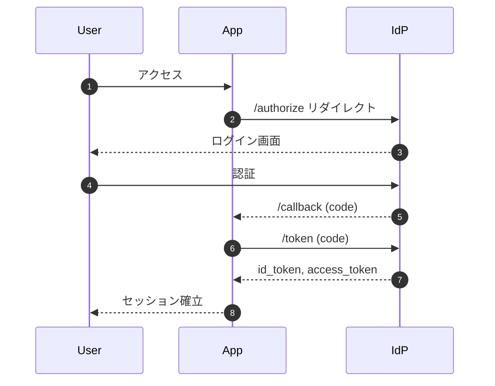

関連: [[data-model|データモデル]]、[[../overview|プロジェクト概要]]
```

- [ ] **Step 6: `vault/10-Projects/alpha/design/data-model.md` を作成**

```markdown
---
title: データモデル
tags: [project/alpha, design]
---

# データモデル

## エンティティ

- `User`: 社員
- `Session`: ログインセッション
- `Role`: 権限ロール

## ER 図

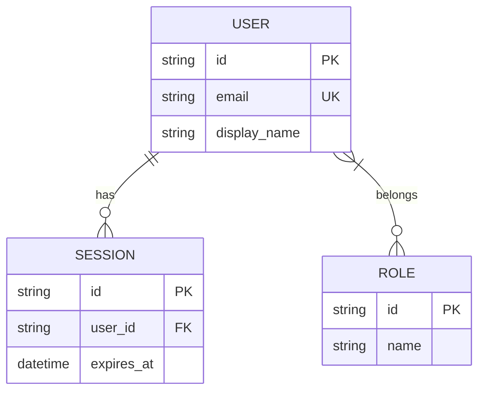

関連: [[auth|認証設計]]
```

- [ ] **Step 7: `vault/20-Knowledge/api-design-principles.md` を作成**

```markdown
---
title: API 設計原則
tags: [knowledge, api]
---

# API 設計原則

## 基本方針

- リソース指向 URL
- HTTP メソッドで動詞を表現（GET/POST/PUT/PATCH/DELETE）
- バージョンは URL パス `/v1/...`
- エラーは RFC 7807 (Problem Details) 形式

## ページング

- cursor ベース推奨。offset ベースはデータ整合性が崩れやすい

## 関連

- [[code-review-checklist]]
- [[observability-basics]]
```

- [ ] **Step 8: `vault/20-Knowledge/code-review-checklist.md` を作成**

```markdown
---
title: コードレビューチェックリスト
tags: [knowledge, review]
---

# コードレビューチェックリスト

## 機能

- [ ] 要件を満たしている
- [ ] エッジケースが考慮されている
- [ ] エラー処理が適切

## 設計

- [ ] 単一責任の原則
- [ ] 過剰な抽象化を避けている
- [ ] 既存パターンに沿っている

## テスト

- [ ] 新規/変更されたロジックにテストがある
- [ ] テストは振る舞いを検証している（実装詳細ではない）

関連: [[api-design-principles]]
```

- [ ] **Step 9: `vault/20-Knowledge/observability-basics.md` を作成**

```markdown
---
title: Observability 基本
tags: [knowledge, observability]
---

# Observability 基本

3 本柱: メトリクス / ログ / トレース。

## メトリクス

- 4 つのゴールデンシグナル: Latency, Traffic, Errors, Saturation
- ヒストグラム（p50/p95/p99）を重視

## ログ

- 構造化ログ（JSON）
- trace_id を必ず含める

## トレース

- OpenTelemetry を採用
- 分散システムでの依存把握に有効

関連: [[api-design-principles]]
```

- [ ] **Step 10: `vault/30-Meetings/2026/04-01.md` を作成**

```markdown
---
title: 2026-04-01 Project Alpha キックオフ
tags: [meeting, project/alpha]
date: 2026-04-01
---

# 2026-04-01 Project Alpha キックオフ

## 参加者

- [[40-People/alice|Alice]]
- [[40-People/bob|Bob]]
- [[40-People/yoshi-komoto|Yoshi]]

## アジェンダ

1. プロジェクトの背景・目的
2. スコープ確認
3. 役割分担

## 決定事項

- TL: Alice
- 認証設計: Bob + Yoshi ペア
- 次回: 設計レビュー

## 関連

- [[../../10-Projects/alpha/overview|Project Alpha 概要]]
```

- [ ] **Step 11: `vault/30-Meetings/2026/04-08.md` を作成**

```markdown
---
title: 2026-04-08 Project Alpha 設計レビュー
tags: [meeting, project/alpha]
date: 2026-04-08
---

# 2026-04-08 Project Alpha 設計レビュー

## 参加者

- [[40-People/alice|Alice]]
- [[40-People/bob|Bob]]
- [[40-People/yoshi-komoto|Yoshi]]

## レビュー対象

- [[../../10-Projects/alpha/design/auth|認証設計]]
- [[../../10-Projects/alpha/design/data-model|データモデル]]

## 指摘事項

- `Session` にデバイス情報を持たせるか要検討
- `Role` の粒度が粗い → 次 Sprint で分割検討

## 次のアクション

- Bob: Session モデル再設計案
- Yoshi: Role 細分化のたたき台
```

- [ ] **Step 12: `vault/40-People/alice.md` を作成**

```markdown
---
title: Alice
tags: [people]
aliases: [alice, ありす]
---

# Alice

Project Alpha の TL。

## 所属プロジェクト

- [[../10-Projects/alpha/overview|Project Alpha]]

## 最近の議事録

- [[../30-Meetings/2026/04-01]]
- [[../30-Meetings/2026/04-08]]
```

- [ ] **Step 13: `vault/40-People/bob.md` を作成**

```markdown
---
title: Bob
tags: [people]
aliases: [bob]
---

# Bob

認証まわりが強いエンジニア。

## 所属プロジェクト

- [[../10-Projects/alpha/overview|Project Alpha]]（認証設計担当）

## 参考にしているドキュメント

- [[../20-Knowledge/api-design-principles|API 設計原則]]
```

- [ ] **Step 14: `vault/40-People/yoshi-komoto.md` を作成**

```markdown
---
title: Yoshi Komoto
tags: [people]
aliases: [yoshi, こもと]
---

# Yoshi Komoto

フルスタック。Observability と CI/CD に強い関心。

## 所属プロジェクト

- [[../10-Projects/alpha/overview|Project Alpha]]

## 記事

- [[../20-Knowledge/observability-basics|Observability 基本]]
```

- [ ] **Step 15: 動作確認**

Run: `git status`
Expected: 14 個の新規 markdown ファイルが追加待ち。

- [ ] **Step 16: コミット**

```bash
git add vault/index.md vault/00-Guide vault/10-Projects vault/20-Knowledge vault/30-Meetings vault/40-People
git commit -m "feat(vault): ガイド/プロジェクト/ナレッジ/議事録/人物ページのサンプルを追加"
```

---

## Task 4: Sandbox 01〜05（基本 / frontmatter / wikilink / embed / 画像）

**Files:**
- Create: `vault/90-Sandbox/01-basic-markdown.md`
- Create: `vault/90-Sandbox/02-frontmatter.md`
- Create: `vault/90-Sandbox/03-wikilinks.md`
- Create: `vault/90-Sandbox/04-embeds.md`
- Create: `vault/90-Sandbox/05-images-attachments.md`

- [ ] **Step 1: `01-basic-markdown.md` を作成**

```markdown
---
title: 01 基本 Markdown
tags: [sandbox]
---

# 見出し H1

## 見出し H2

### 見出し H3

#### 見出し H4

##### 見出し H5

###### 見出し H6

## 段落・強調

これは段落です。**太字**、*斜体*、~~取り消し線~~、`インラインコード`。

## リスト

- 箇条書き 1
- 箇条書き 2
  - ネスト 2-1
  - ネスト 2-2
- 箇条書き 3

1. 番号付き 1
2. 番号付き 2
3. 番号付き 3

## 引用

> 一行の引用です。
>
> > ネストした引用。

## 水平線

---

## リンク

- [外部リンク](https://example.com)
- [[02-frontmatter|内部リンク（次のページ）]]
```

- [ ] **Step 2: `02-frontmatter.md` を作成**

```markdown
---
title: 02 Frontmatter サンプル
tags: [sandbox, sandbox/frontmatter]
aliases: [フロントマター, FM サンプル]
date: 2026-04-13
author: Yoshi Komoto
draft: false
description: frontmatter の各フィールドを含むサンプル
---

# 02 Frontmatter サンプル

このページは frontmatter に以下を含みます:

- `title`: ページタイトル
- `tags`: 階層タグ含む
- `aliases`: 別名での到達
- `date`: 作成日
- `author`: 著者
- `draft`: 下書きフラグ（false のため公開対象）
- `description`: ページ説明

## 検証ポイント

- 両 SSG で `title` が使われているか
- aliases での到達性は [[18-aliases|18]] を参照
```

- [ ] **Step 3: `03-wikilinks.md` を作成**

```markdown
---
title: 03 Wikilink
tags: [sandbox]
---

# 03 Wikilink

## 基本

- [[02-frontmatter]] — ページ名のみ
- [[02-frontmatter|フロントマターのサンプル]] — 表示名指定
- [[01-basic-markdown#リスト]] — 見出し指定

## 別ディレクトリ

- [[../40-People/alice]] — 相対パス
- [[40-People/bob|Bob さん]] — ルート相対 + alias

## alias 経由

- [[alice|ありすへ]] — aliases 定義を利用
- [[Alpha概要]] — aliases 経由（[[../10-Projects/alpha/overview]]）

## 未解決リンク（意図的に壊れたリンク）

- [[non-existent-page]] — 未作成ページ
```

- [ ] **Step 4: `04-embeds.md` を作成**

```markdown
---
title: 04 埋め込み
tags: [sandbox]
---

# 04 埋め込み (Embed)

## ノート全体の埋め込み

![[02-frontmatter]]

## 特定セクションの埋め込み

![[01-basic-markdown#リスト]]

## 画像埋め込み

![[sample-diagram.png]]

![[sample-photo.png|300]]

## 検証ポイント

- Quartz: transclusion（`ObsidianFlavoredMarkdown` プラグイン）で展開されるか
- MkDocs: `obsidian-support` プラグインで展開されるか
- 画像サイズ指定（`|300`）が効くか
```

- [ ] **Step 5: `05-images-attachments.md` を作成**

```markdown
---
title: 05 画像と添付
tags: [sandbox]
---

# 05 画像と添付

## 通常の Markdown 画像


## Obsidian 形式

![[sample-diagram.png]]

## 添付ファイル

- [サンプル PDF](../_attachments/sample.pdf)
- [サンプル ZIP](../_attachments/sample.zip)

## 検証ポイント

- 通常記法と Obsidian 記法の両方が描画されるか
- 添付ダウンロードリンクが機能するか
```

- [ ] **Step 6: コミット**

```bash
git add vault/90-Sandbox/01-basic-markdown.md vault/90-Sandbox/02-frontmatter.md vault/90-Sandbox/03-wikilinks.md vault/90-Sandbox/04-embeds.md vault/90-Sandbox/05-images-attachments.md
git commit -m "feat(vault): Sandbox 01-05（基本/FM/wikilink/embed/画像）を追加"
```

---

## Task 5: Sandbox 06〜10（callout / tag / Mermaid / PlantUML / コード）

**Files:**
- Create: `vault/90-Sandbox/06-callouts.md`
- Create: `vault/90-Sandbox/07-tags.md`
- Create: `vault/90-Sandbox/08-mermaid.md`
- Create: `vault/90-Sandbox/09-plantuml.md`
- Create: `vault/90-Sandbox/10-code-blocks.md`

- [ ] **Step 1: `06-callouts.md` を作成**

````markdown
---
title: 06 Callout 12 種
tags: [sandbox]
---

# 06 Callout 12 種

> [!note] ノート
> 一般的な補足情報。

> [!info] 情報
> 参考情報として。

> [!tip] ヒント
> こうするとうまくいきます。

> [!warning] 注意
> 破壊的な操作を行います。

> [!danger] 危険
> 本番データを消す可能性があります。

> [!quote] 引用
> > The best code is no code at all.

> [!example] 例
> ```ts
> const x = 1;
> ```

> [!question] 質問
> これは要件に含まれていますか？

> [!success] 成功
> テストが全て通過しました。

> [!failure] 失敗
> ビルドが失敗しました。

> [!bug] バグ
> 境界値で NPE 発生。

> [!todo] TODO
> 後で callback を実装する。

## 折りたたみ

> [!note]- 折りたたみ可能な callout（デフォルト閉じ）
> 開くと中身が見える。

## 検証ポイント

- 12 種類すべてに固有のスタイル/アイコンが付くか
- 折りたたみ挙動が機能するか
````

- [ ] **Step 2: `07-tags.md` を作成**

```markdown
---
title: 07 タグ
tags: [sandbox, sandbox/tag, category/technology/web]
---

# 07 タグ

## インラインタグ

本文中で #inline-tag や #area/backend のように記述できます。

## 階層タグ

- #category/technology/web
- #category/technology/database
- #category/process/review

## 検証ポイント

- frontmatter の tags とインラインタグが統合されるか
- 階層タグ（`/` 区切り）のナビゲーションが生成されるか
```

- [ ] **Step 3: `08-mermaid.md` を作成**

````markdown
---
title: 08 Mermaid
tags: [sandbox]
---

# 08 Mermaid

## Flowchart

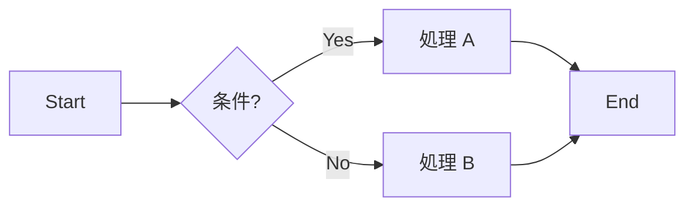

## Sequence

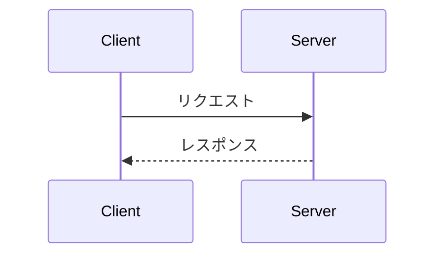

## Class

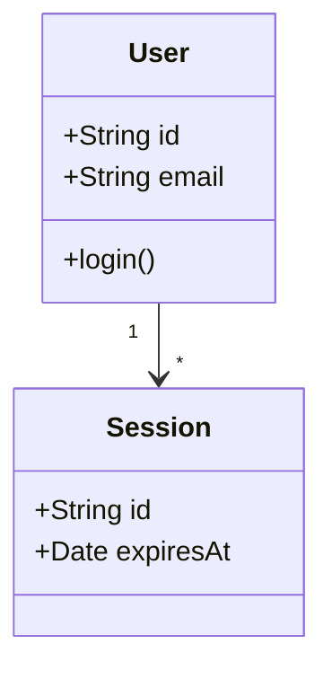

## ER

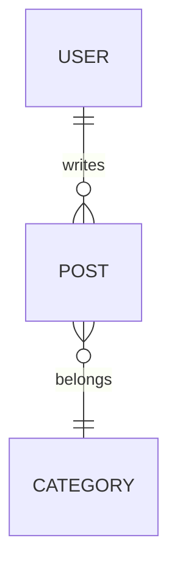

## Gantt

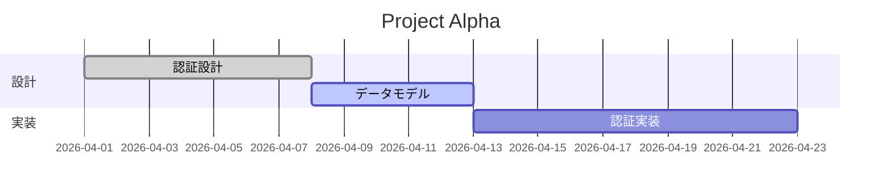

## 検証ポイント

- 5 種類すべて描画されるか
- ダークモード時に読めるか
````

- [ ] **Step 4: `09-plantuml.md` を作成**

````markdown
---
title: 09 PlantUML
tags: [sandbox]
---

# 09 PlantUML

Growi で常用されている PlantUML が両 SSG で描画できるか検証する。

## Sequence

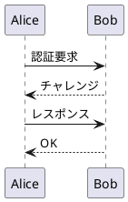

## Use Case

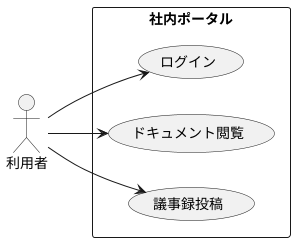

## Class

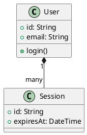

## 検証ポイント

- Quartz: `remark-plantuml` 系プラグインでサーバレンダリングされるか
- MkDocs: `plantuml-markdown` 拡張でレンダリングされるか
- PlantUML サーバ: `www.plantuml.com/plantuml`（比較フェーズのみ。本番は社内サーバ検討）
````

- [ ] **Step 5: `10-code-blocks.md` を作成**

````markdown
---
title: 10 コードブロック
tags: [sandbox]
---

# 10 コードブロック

## TypeScript

```typescript
interface User {
  id: string;
  email: string;
}

async function fetchUser(id: string): Promise<User> {
  const res = await fetch(`/api/users/${id}`);
  if (!res.ok) throw new Error(`HTTP ${res.status}`);
  return res.json();
}
```

## Python

```python
from dataclasses import dataclass

@dataclass
class User:
    id: str
    email: str

def greet(user: User) -> str:
    return f"Hello, {user.email}"
```

## Bash

```bash
#!/usr/bin/env bash
set -euo pipefail

for f in vault/**/*.md; do
  echo "Processing $f"
done
```

## Diff

```diff
 function add(a, b) {
-  return a + b
+  return a + b + 0  // noop
 }
```

## 言語指定なし

```
素のテキスト。
半角スペース        保持される。
```

## 長いコード（横スクロール検証）

```javascript
const veryLongLine = "This is a deliberately long line to test how the rendered site handles horizontal overflow. It should probably wrap or add a horizontal scrollbar. Let us see how each SSG handles this situation in practice.";
```

## 検証ポイント

- シンタックスハイライト有無（6 言語）
- 横スクロール挙動
- コピーボタンの有無
````

- [ ] **Step 6: コミット**

```bash
git add vault/90-Sandbox/06-callouts.md vault/90-Sandbox/07-tags.md vault/90-Sandbox/08-mermaid.md vault/90-Sandbox/09-plantuml.md vault/90-Sandbox/10-code-blocks.md
git commit -m "feat(vault): Sandbox 06-10（callout/tag/mermaid/plantuml/code）を追加"
```

---

## Task 6: Sandbox 11〜15（表 / 数式 / 脚注・タスク / 長文日本語 / 絵文字）

**Files:**
- Create: `vault/90-Sandbox/11-tables.md`
- Create: `vault/90-Sandbox/12-math.md`
- Create: `vault/90-Sandbox/13-footnotes-tasks.md`
- Create: `vault/90-Sandbox/14-long-japanese.md`
- Create: `vault/90-Sandbox/15-emoji.md`

- [ ] **Step 1: `11-tables.md` を作成**

```markdown
---
title: 11 表
tags: [sandbox]
---

# 11 表

## 基本

| 項目 | 値 | 備考 |
|---|---|---|
| A | 100 | 標準 |
| B | 200 | オプション |
| C | 300 | 拡張 |

## アライメント指定

| 左寄せ | 中央 | 右寄せ |
|:---|:---:|---:|
| apple | 100 | 1.5 |
| banana | 20 | 12.5 |
| cherry | 3 | 125.5 |

## 広めの表

| コンポーネント | 責務 | 依存先 | 備考 |
|---|---|---|---|
| API Gateway | 認証・ルーティング | IdP | OIDC |
| Auth Service | トークン管理 | DB, Cache | JWT |
| User Service | ユーザー CRUD | DB | |
| Notification | 通知配信 | Queue, Email | 非同期 |

## 検証ポイント

- アライメントが効くか
- 横スクロール or 折り返しの挙動
```

- [ ] **Step 2: `12-math.md` を作成**

```markdown
---
title: 12 数式 (KaTeX)
tags: [sandbox]
---

# 12 数式 (KaTeX)

## インライン

ピタゴラス: $a^2 + b^2 = c^2$ と $E = mc^2$ は有名。

## ブロック

$$
\int_{-\infty}^{\infty} e^{-x^2} dx = \sqrt{\pi}
$$

$$
\begin{aligned}
f(x) &= (x+1)^2 \\
     &= x^2 + 2x + 1
\end{aligned}
$$

## 行列

$$
A = \begin{pmatrix} 1 & 2 \\ 3 & 4 \end{pmatrix}
$$

## 検証ポイント

- インライン/ブロック両方描画されるか
- 記号が崩れないか
```

- [ ] **Step 3: `13-footnotes-tasks.md` を作成**

```markdown
---
title: 13 脚注とタスクリスト
tags: [sandbox]
---

# 13 脚注とタスクリスト

## 脚注

本文中に脚注を付けます[^1]。複数置けます[^note2]。

[^1]: これは脚注 1 です。
[^note2]: これは名前付き脚注です。

## タスクリスト

- [x] 完了タスク
- [ ] 未完了タスク
- [ ] ネスト可能
  - [x] サブタスク 1
  - [ ] サブタスク 2

## 検証ポイント

- 脚注リンクのジャンプが機能するか
- チェックボックスが描画されるか（クリックでの状態変更は不要）
```

- [ ] **Step 4: `14-long-japanese.md` を作成（長文 TOC 検証用）**

```markdown
---
title: 14 長文日本語（TOC 検証）
tags: [sandbox]
---

# 14 長文日本語（TOC 検証）

本ページは TOC と読みやすさ、ビルド速度を計測するための長文サンプルです。

## 1. はじめに

ソフトウェアエンジニアリングにおける観測可能性（Observability）は、システムの内部状態を外部から推測できる度合いを指します。従来のモニタリングが「既知の不具合を検知する」ことに重点を置いていたのに対し、観測可能性は「未知の不具合を調査可能にする」ことに焦点を当てています。これは、マイクロサービスやサーバーレスなどの分散システムにおいて、障害の原因を事後的に追跡するためには不可欠な能力です。

## 2. 三本柱

一般に観測可能性はメトリクス、ログ、トレースの三本柱で語られます。それぞれ以下の役割を担います。

### 2.1 メトリクス

メトリクスは数値の時系列データです。CPU 使用率、レイテンシ、リクエスト数、エラー率などが典型例です。集約しやすく、ダッシュボードやアラートに適していますが、個別のリクエストの追跡には向きません。Google の SRE 本で語られる「四つのゴールデンシグナル」はレイテンシ、トラフィック、エラー、飽和度の四つであり、サービスの健康状態を表現する最小集合として広く採用されています。

### 2.2 ログ

ログは時刻付きのイベント記録です。構造化ログ（JSON）を採用し、一貫したフィールド名と `trace_id` を含めることで、トレースとの突き合わせが容易になります。大量のログを保存するコストは無視できず、サンプリングやログレベルの設計が重要です。

### 2.3 トレース

分散トレースはリクエストが複数のサービスを経由する様子を時間軸で可視化します。OpenTelemetry の普及により、ベンダー非依存の計装が可能になりました。Span と Trace という概念を用い、親子関係と時間を記録します。

## 3. 実装上の注意

### 3.1 高カーディナリティ問題

メトリクスのラベルに user_id のような高カーディナリティのフィールドを入れると、時系列データベースが破綻します。一般に数千以上のユニーク値を持つラベルは避けるべきです。

### 3.2 サンプリング

全トレースを保存するのはコスト的に非現実的です。ヘッドベースサンプリング（リクエスト開始時に保存するか決める）とテールベースサンプリング（完了後にエラーや遅延があったものを残す）があります。後者の方が運用価値は高いが実装コストも高いです。

### 3.3 プライバシー

ログやトレースに個人情報や認証情報が混入するのは重大なインシデントにつながります。フィールドレベルのマスキングをプラットフォームで提供することが推奨されます。

## 4. ツール選定

### 4.1 マネージド

Datadog、New Relic、Honeycomb などが代表的です。初期導入のコストは低いが、利用量に応じて料金が急増する傾向があります。

### 4.2 セルフホスト

Prometheus + Grafana + Loki + Tempo のような組み合わせが広く用いられます。初期コストは高いが、ランニングは予測しやすくなります。

### 4.3 ハイブリッド

重要なシグナルだけをマネージドに流し、詳細はセルフホストに残すという分割も現実的です。

## 5. 組織的な視点

観測可能性はツール導入だけでは定着しません。ポストモーテム文化、オンコール体制、SLO の設定といった運用文化が伴って初めて効果を発揮します。SLO をサービスごとに定義し、エラーバジェットを消費している状態では新規開発を抑制するという運用は、開発と運用の優先順位を客観的に調停する手段として有効です。

## 6. まとめ

観測可能性は単なる技術スタックではなく、組織と文化の話でもあります。三本柱を揃え、プライバシーとコストに配慮し、SLO を通じて事業と接続することが、現代のシステム運用における基盤となります。

---

## 検証ポイント

- 目次（TOC）が自動生成されるか
- アンカーリンクが機能するか
- ページ内検索（Ctrl+F）の日本語挙動
- ビルド速度
```

- [ ] **Step 5: `15-emoji.md` を作成**

```markdown
---
title: 15 絵文字
tags: [sandbox]
---

# 15 絵文字

## Unicode 直接

リリース完了 🎉 です。バグあり 🐛 要修正 🔧。

## ショートコード

:smile: :rocket: :warning: :heavy_check_mark: :x:

## GitHub 風

:+1: :-1: :tada: :fire: :construction:

## 検証ポイント

- Unicode 絵文字の表示
- ショートコード `:name:` が変換されるか（SSG によって有無）
```

- [ ] **Step 6: コミット**

```bash
git add vault/90-Sandbox/11-tables.md vault/90-Sandbox/12-math.md vault/90-Sandbox/13-footnotes-tasks.md vault/90-Sandbox/14-long-japanese.md vault/90-Sandbox/15-emoji.md
git commit -m "feat(vault): Sandbox 11-15（表/数式/脚注/長文日本語/絵文字）を追加"
```

---

## Task 7: Sandbox 16〜20（Growi 移行 / backlink / alias / 日本語検索 / draft）

**Files:**
- Create: `vault/90-Sandbox/16-growi-migration.md`
- Create: `vault/90-Sandbox/17-backlinks-hub.md`
- Create: `vault/90-Sandbox/17-backlinks-a.md`
- Create: `vault/90-Sandbox/17-backlinks-b.md`
- Create: `vault/90-Sandbox/18-aliases.md`
- Create: `vault/90-Sandbox/18-aliases-old-name.md`
- Create: `vault/90-Sandbox/19-japanese-search.md`
- Create: `vault/90-Sandbox/20-draft-example.md`

- [ ] **Step 1: `16-growi-migration.md` を作成**

````markdown
---
title: 16 Growi 移行注意点
tags: [sandbox, migration]
---

# 16 Growi 移行注意点

Growi 特有の記法 → Obsidian 形式への書き換え指針。

## パスリンク

**Before (Growi):**

```
[/project/alpha/design/auth]
```

**After (Obsidian):**

```
[[10-Projects/alpha/design/auth|認証設計]]
```

## PlantUML

**Before (Growi)** — 独自の拡張ブロックを使っているケース:

```
@startuml
Alice -> Bob: Hello
@enduml
```

（本文中に直接書かれていた場合）

**After (Obsidian):**

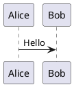

必ず ` ```plantuml ` フェンスで囲む。

## 画像パス

**Before (Growi):**

```

```

**After (Obsidian):**

```
![[sample-diagram.png]]
```

添付ファイルを `vault/_attachments/` に配置し、Obsidian 形式で参照。

## コメント / いいね / 履歴

- コメント機能: 静的サイトでは非対応。PR/Issue に寄せる運用に変更
- いいね: 非対応（Slack リアクション等で代替）
- 履歴: Git 履歴に移行（`git log <file>`）

## 検証ポイント

- Before/After の両方が記事内で正しく描画されるか（After のみ描画、Before は Code として残す）
````

- [ ] **Step 2: `17-backlinks-hub.md` を作成**

```markdown
---
title: 17 Backlink Hub
tags: [sandbox, backlink]
---

# 17 Backlink Hub

このページは [[17-backlinks-a]] と [[17-backlinks-b]] から参照されている（= 被リンクが発生する）ハブです。

## 検証ポイント

- ページ下部の backlinks セクションに a と b が表示されるか
- graph view 上で hub を中心にエッジが見えるか
```

- [ ] **Step 3: `17-backlinks-a.md` を作成**

```markdown
---
title: 17 Backlink A
tags: [sandbox, backlink]
---

# 17 Backlink A

このページは [[17-backlinks-hub|Hub]] を参照している。

そして [[17-backlinks-b|B]] も参照している。
```

- [ ] **Step 4: `17-backlinks-b.md` を作成**

```markdown
---
title: 17 Backlink B
tags: [sandbox, backlink]
---

# 17 Backlink B

このページは [[17-backlinks-hub|Hub]] を参照している。

[[../40-People/alice|Alice]] も参照している。
```

- [ ] **Step 5: `18-aliases.md` を作成**

```markdown
---
title: 18 Alias 到達
tags: [sandbox]
aliases: [別名1, 別名2, オブザビリティ]
---

# 18 Alias 到達

このページは aliases `[別名1, 別名2, オブザビリティ]` を持つ。以下のリンクはすべて本ページに到達する想定。

- [[18-aliases]]（ファイル名）
- [[別名1]]
- [[別名2]]
- [[オブザビリティ]]

## 旧名からの到達

- [[18-aliases-old-name|旧名ページ]]（aliases で `真の18` を持つ）→ [[真の18]] でも到達可能

## 検証ポイント

- Quartz: alias 解決の挙動
- MkDocs: `ezlinks` / `roamlinks` プラグインでの alias 対応
```

- [ ] **Step 6: `18-aliases-old-name.md` を作成**

```markdown
---
title: 18 旧名ページ
tags: [sandbox]
aliases: [真の18]
---

# 18 旧名ページ

以前この名前だったページ。aliases `真の18` を持つ。

参考: [[18-aliases]]
```

- [ ] **Step 7: `19-japanese-search.md` を作成**

```markdown
---
title: 19 日本語全文検索サンプル
tags: [sandbox, search]
---

# 19 日本語全文検索サンプル

両 SSG の日本語検索精度を比較するための専用ページ。以下のキーワードで検索し、ヒット率と関連度を観察する。

## 検索対象キーワード

- 専門用語: 冪等性、排他制御、楽観的ロック、悲観的ロック
- 固有名詞: OpenTelemetry、Kubernetes、PostgreSQL
- 漢字とカタカナ: データベースのスキーマ定義、マイクロサービスアーキテクチャ
- ひらがな: あいまい検索でも見つかるか
- 複合語: 認証認可、分散トレーシング、プロンプトインジェクション

## 本文

認証認可システムにおいて冪等性を保証することは、分散システムの信頼性を支える重要な設計原則である。楽観的ロックと悲観的ロックの使い分けは、トランザクションの競合頻度とコストに依存して決定される。排他制御が不適切だとデータベースのデッドロックや整合性崩れを招く。

OpenTelemetry は Kubernetes 上のマイクロサービスアーキテクチャにおいて、分散トレーシングを実現する事実上の標準である。PostgreSQL をバックエンドとする場合、スキーマ定義と ER モデルのレビューが品質の基礎となる。

セキュリティ面ではプロンプトインジェクションへの対策が重要で、特に LLM ベースのアプリケーションでは入力サニタイズだけでなく、コンテキスト境界の分離設計が求められる。

## 検証ポイント

- 漢字・カタカナ・ひらがなの混在キーワードでヒットするか
- 部分一致・前方一致・後方一致の挙動
- 検索結果のハイライト精度
```

- [ ] **Step 8: `20-draft-example.md` を作成**

```markdown
---
title: 20 下書き（draft）
tags: [sandbox]
draft: true
---

# 20 下書き（公開されない想定）

このページは `draft: true` を持つため、両 SSG の公開サイトでは非表示になるべき。

Obsidian 上では普通に編集でき、公開サイトにはビルド時に除外される。

## 検証ポイント

- Quartz の public ビルドに含まれないか
- MkDocs の public ビルドに含まれないか
- Obsidian では通常通り閲覧できるか
```

- [ ] **Step 9: コミット**

```bash
git add vault/90-Sandbox/16-growi-migration.md vault/90-Sandbox/17-backlinks-hub.md vault/90-Sandbox/17-backlinks-a.md vault/90-Sandbox/17-backlinks-b.md vault/90-Sandbox/18-aliases.md vault/90-Sandbox/18-aliases-old-name.md vault/90-Sandbox/19-japanese-search.md vault/90-Sandbox/20-draft-example.md
git commit -m "feat(vault): Sandbox 16-20（Growi移行/backlink/alias/日本語検索/draft）を追加"
```

---

## Task 8: 添付ファイル・テンプレート

**Files:**
- Create: `vault/_attachments/sample-diagram.png` (プレースホルダ PNG を PowerShell で生成)
- Create: `vault/_attachments/sample-photo.png`
- Create: `vault/_attachments/sample.pdf` (ダミー PDF を生成)
- Create: `vault/_attachments/sample.zip` (テキストファイルを zip)
- Create: `vault/_templates/meeting.md`
- Create: `vault/_templates/project.md`

- [ ] **Step 1: ダミー画像を PowerShell で生成**

Run (PowerShell):
```powershell
Add-Type -AssemblyName System.Drawing
$bmp = New-Object System.Drawing.Bitmap 400, 300
$g = [System.Drawing.Graphics]::FromImage($bmp)
$g.Clear([System.Drawing.Color]::LightSteelBlue)
$font = New-Object System.Drawing.Font("Arial", 24)
$brush = [System.Drawing.Brushes]::DarkSlateBlue
$g.DrawString("Sample Diagram", $font, $brush, 70, 120)
$bmp.Save("vault/_attachments/sample-diagram.png", [System.Drawing.Imaging.ImageFormat]::Png)
$g.Dispose(); $bmp.Dispose()

$bmp2 = New-Object System.Drawing.Bitmap 600, 400
$g2 = [System.Drawing.Graphics]::FromImage($bmp2)
$g2.Clear([System.Drawing.Color]::DarkSeaGreen)
$g2.DrawString("Sample Photo", $font, [System.Drawing.Brushes]::DarkGreen, 180, 180)
$bmp2.Save("vault/_attachments/sample-photo.png", [System.Drawing.Imaging.ImageFormat]::Png)
$g2.Dispose(); $bmp2.Dispose()
```

- [ ] **Step 2: ダミー PDF を生成**

ダミー PDF はバイナリなので、以下の最小 PDF を書き出す。

Run (PowerShell):
```powershell
$pdfContent = @"
%PDF-1.4
1 0 obj<</Type/Catalog/Pages 2 0 R>>endobj
2 0 obj<</Type/Pages/Kids[3 0 R]/Count 1>>endobj
3 0 obj<</Type/Page/Parent 2 0 R/MediaBox[0 0 612 792]/Contents 4 0 R/Resources<</Font<</F1 5 0 R>>>>>>endobj
4 0 obj<</Length 44>>stream
BT /F1 24 Tf 100 700 Td (Sample PDF) Tj ET
endstream endobj
5 0 obj<</Type/Font/Subtype/Type1/BaseFont/Helvetica>>endobj
xref
0 6
0000000000 65535 f
0000000009 00000 n
0000000052 00000 n
0000000095 00000 n
0000000186 00000 n
0000000271 00000 n
trailer<</Size 6/Root 1 0 R>>
startxref
333
%%EOF
"@
[System.IO.File]::WriteAllBytes("vault/_attachments/sample.pdf", [System.Text.Encoding]::ASCII.GetBytes($pdfContent))
```

- [ ] **Step 3: ダミー zip を生成**

Run (PowerShell):
```powershell
$tmpDir = New-Item -ItemType Directory -Path "$env:TEMP\md-sample-zip" -Force
"Sample content for zip verification." | Out-File "$tmpDir\readme.txt"
Compress-Archive -Path "$tmpDir\*" -DestinationPath "vault/_attachments/sample.zip" -Force
Remove-Item -Recurse -Force $tmpDir
```

- [ ] **Step 4: `vault/_templates/meeting.md` を作成**

```markdown
---
title: {{date:YYYY-MM-DD}} 議事録
tags: [meeting]
date: {{date:YYYY-MM-DD}}
---

# {{date:YYYY-MM-DD}} 議事録

## 参加者

-

## アジェンダ

1.

## 決定事項

-

## 次のアクション

-
```

- [ ] **Step 5: `vault/_templates/project.md` を作成**

```markdown
---
title: {{title}} 概要
tags: [project]
aliases: []
---

# {{title}} 概要

## 目的

## 関連ドキュメント

-

## メンバー

-

## 議事録

-
```

- [ ] **Step 6: 動作確認**

Run (PowerShell):
```powershell
Get-ChildItem vault/_attachments
```
Expected: `sample-diagram.png`, `sample-photo.png`, `sample.pdf`, `sample.zip` が存在し、サイズ > 0。

- [ ] **Step 7: コミット**

```bash
git add vault/_attachments vault/_templates
git commit -m "feat(vault): 添付ファイル(ダミー)とテンプレートを追加"
```

---

## Task 9: symlink セットアップスクリプト

**Files:**
- Create: `scripts/setup-symlinks.ps1`

- [ ] **Step 1: `scripts/setup-symlinks.ps1` を作成**

```powershell
#Requires -Version 7
<#
.SYNOPSIS
    sites/quartz/content と sites/mkdocs/docs を vault/ への symlink として作成する。
.DESCRIPTION
    Windows では symlink の作成に Developer Mode 有効化または管理者権限が必要。
    Git 側では `git config --global core.symlinks true` を推奨。
#>

[CmdletBinding()]
param(
    [switch]$Force
)

$ErrorActionPreference = 'Stop'

$repoRoot = Split-Path -Parent $PSScriptRoot
$vaultAbs = Join-Path $repoRoot 'vault'

if (-not (Test-Path $vaultAbs)) {
    throw "vault/ が見つかりません: $vaultAbs"
}

$targets = @(
    @{ Link = (Join-Path $repoRoot 'sites/quartz/content'); Target = '../../vault' },
    @{ Link = (Join-Path $repoRoot 'sites/mkdocs/docs');    Target = '../../vault' }
)

foreach ($t in $targets) {
    $linkPath = $t.Link
    $target   = $t.Target
    $parent   = Split-Path -Parent $linkPath
    if (-not (Test-Path $parent)) {
        New-Item -ItemType Directory -Force -Path $parent | Out-Null
    }

    if (Test-Path $linkPath) {
        $item = Get-Item $linkPath -Force
        if ($item.LinkType -eq 'SymbolicLink') {
            Write-Host "既に symlink が存在: $linkPath -> $($item.Target)"
            if (-not $Force) { continue }
            Remove-Item $linkPath -Force
        } elseif ($Force) {
            Write-Warning "実体ディレクトリ/ファイルが存在。-Force により削除: $linkPath"
            Remove-Item $linkPath -Recurse -Force
        } else {
            throw "$linkPath は symlink でなく実体です。-Force を指定して再実行してください。"
        }
    }

    try {
        New-Item -ItemType SymbolicLink -Path $linkPath -Target $target -Force | Out-Null
        Write-Host "created: $linkPath -> $target"
    } catch {
        Write-Error "symlink 作成失敗: $linkPath"
        Write-Error "Developer Mode が有効か、または管理者として実行しているか確認してください。"
        throw
    }
}

Write-Host "完了: symlink を作成しました。"
```

- [ ] **Step 2: 動作確認（この時点では sites/quartz・sites/mkdocs ディレクトリが未作成なので、エラーにならないか確認）**

Run (PowerShell):
```powershell
pwsh ./scripts/setup-symlinks.ps1
```
Expected: `sites/quartz` `sites/mkdocs` のディレクトリが作成され、それぞれに symlink が張られる。`ls sites/quartz/content` で vault/ の内容が見える。

- [ ] **Step 3: symlink の動作確認**

Run (PowerShell):
```powershell
Get-ChildItem sites/quartz/content | Select-Object -First 3
Get-ChildItem sites/mkdocs/docs | Select-Object -First 3
```
Expected: どちらも `index.md`, `00-Guide/`, `10-Projects/` 等の vault/ 内容を表示。

- [ ] **Step 4: コミット**

```bash
git add scripts/setup-symlinks.ps1 sites/quartz/content sites/mkdocs/docs
git commit -m "feat(scripts): symlink セットアップスクリプトと symlink を追加"
```

---

## Task 10: ローカルプレビュースクリプト

**Files:**
- Create: `scripts/preview.ps1`

- [ ] **Step 1: `scripts/preview.ps1` を作成**

```powershell
#Requires -Version 7
<#
.SYNOPSIS
    Quartz と MkDocs のローカルプレビューを同時起動する。
.DESCRIPTION
    Quartz: Node.js で localhost:8080
    MkDocs: Docker で localhost:8000（ローカル Python 非前提）
#>

[CmdletBinding()]
param(
    [ValidateSet('both','quartz','mkdocs')]
    [string]$Target = 'both'
)

$ErrorActionPreference = 'Stop'
$repoRoot = Split-Path -Parent $PSScriptRoot

function Start-Quartz {
    $quartzDir = Join-Path $repoRoot 'sites/quartz'
    if (-not (Test-Path (Join-Path $quartzDir 'package.json'))) {
        Write-Warning "Quartz 未初期化。Task 11 を先に実施してください。"
        return
    }
    Write-Host "Starting Quartz on http://localhost:8080 ..."
    Start-Process pwsh -ArgumentList "-NoExit","-Command","cd '$quartzDir'; npx quartz build --serve"
}

function Start-MkDocs {
    $mkdocsDir = Join-Path $repoRoot 'sites/mkdocs'
    if (-not (Test-Path (Join-Path $mkdocsDir 'mkdocs.yml'))) {
        Write-Warning "MkDocs 未初期化。Task 12 を先に実施してください。"
        return
    }
    $dockerCheck = Get-Command docker -ErrorAction SilentlyContinue
    if (-not $dockerCheck) {
        Write-Warning "Docker が見つかりません。MkDocs のローカルプレビューには Docker が必要です。"
        return
    }
    Write-Host "Starting MkDocs on http://localhost:8000 (via Docker) ..."
    $repoMount = $repoRoot -replace '\\','/'
    Start-Process pwsh -ArgumentList "-NoExit","-Command","docker run --rm -it -p 8000:8000 -v '${repoMount}:/workspace' -w /workspace/sites/mkdocs squidfunk/mkdocs-material:latest serve -a 0.0.0.0:8000"
}

if ($Target -in 'both','quartz') { Start-Quartz }
if ($Target -in 'both','mkdocs') { Start-MkDocs }

Write-Host ""
Write-Host "プレビューは別ウィンドウで起動しました。停止するには各ウィンドウで Ctrl+C。"
```

- [ ] **Step 2: 動作確認（スクリプト単体で起動可能か）**

Run (PowerShell):
```powershell
pwsh ./scripts/preview.ps1 -Target quartz
```
Expected (この時点では Quartz 未初期化なので): "Quartz 未初期化。Task 11 を先に実施してください。" が表示される。

- [ ] **Step 3: コミット**

```bash
git add scripts/preview.ps1
git commit -m "feat(scripts): ローカルプレビュー起動スクリプトを追加"
```

---

## Task 11: Quartz v4 初期化と設定

**Files:**
- Create: `sites/quartz/` 配下の Quartz 一式（clone ベース）
- Modify: `sites/quartz/quartz.config.ts`
- Modify: `sites/quartz/quartz.layout.ts`
- Update: `sites/quartz/content`（symlink は Task 9 で作成済みだが Quartz clone で上書きされる可能性があるため再確認）

- [ ] **Step 1: Quartz v4 を clone しベースを導入**

Run (PowerShell):
```powershell
# 既存の sites/quartz を退避（symlink を守る）
if (Test-Path sites/quartz/content) { Remove-Item sites/quartz/content -Force }

# Quartz を一時ディレクトリへ clone
$tmp = New-Item -ItemType Directory -Path "$env:TEMP\quartz-src" -Force
git clone --depth 1 https://github.com/jackyzha0/quartz $tmp.FullName

# sites/quartz を作り、Quartz のソースをコピー（.git は除外）
New-Item -ItemType Directory -Force sites/quartz | Out-Null
Get-ChildItem $tmp.FullName -Force -Exclude '.git' | Copy-Item -Destination sites/quartz -Recurse -Force
Remove-Item -Recurse -Force $tmp.FullName

# content をデフォルトで作られたディレクトリから symlink に戻す
if (Test-Path sites/quartz/content) {
    Remove-Item sites/quartz/content -Recurse -Force
}
pwsh ./scripts/setup-symlinks.ps1 -Force
```

- [ ] **Step 2: Quartz 依存をインストール**

Run (PowerShell):
```powershell
cd sites/quartz
npm install
cd ../..
```

- [ ] **Step 3: Quartz ベースビルドで動作確認**

Run (PowerShell):
```powershell
cd sites/quartz
npx quartz build
cd ../..
```
Expected: `sites/quartz/public/` に静的ファイルが生成。エラーなし。

- [ ] **Step 4: `sites/quartz/quartz.config.ts` を本プロジェクト用に編集**

以下の内容で上書きする:

```typescript
import { QuartzConfig } from "./quartz/cfg"
import * as Plugin from "./quartz/plugins"

const config: QuartzConfig = {
  configuration: {
    pageTitle: "社内ナレッジベース (Quartz)",
    enableSPA: true,
    enablePopovers: true,
    analytics: null,
    locale: "ja-JP",
    baseUrl: "<org>.github.io/md/quartz",
    ignorePatterns: [
      "_templates",
      ".obsidian",
      ".trash",
      "private",
    ],
    defaultDateType: "created",
    theme: {
      fontOrigin: "googleFonts",
      cdnCaching: true,
      typography: {
        header: "Schibsted Grotesk",
        body: "Source Sans Pro",
        code: "IBM Plex Mono",
      },
      colors: {
        lightMode: {
          light: "#faf8f8",
          lightgray: "#e5e5e5",
          gray: "#b8b8b8",
          darkgray: "#4e4e4e",
          dark: "#2b2b2b",
          secondary: "#284b63",
          tertiary: "#84a59d",
          highlight: "rgba(143, 159, 169, 0.15)",
        },
        darkMode: {
          light: "#161618",
          lightgray: "#393639",
          gray: "#646464",
          darkgray: "#d4d4d4",
          dark: "#ebebec",
          secondary: "#7b97aa",
          tertiary: "#84a59d",
          highlight: "rgba(143, 159, 169, 0.15)",
        },
      },
    },
  },
  plugins: {
    transformers: [
      Plugin.FrontMatter(),
      Plugin.CreatedModifiedDate({ priority: ["frontmatter", "filesystem"] }),
      Plugin.SyntaxHighlighting({ theme: { light: "github-light", dark: "github-dark" }, keepBackground: false }),
      Plugin.ObsidianFlavoredMarkdown({ enableInHtmlEmbed: false }),
      Plugin.GitHubFlavoredMarkdown(),
      Plugin.TableOfContents(),
      Plugin.CrawlLinks({ markdownLinkResolution: "shortest" }),
      Plugin.Description(),
      Plugin.Latex({ renderEngine: "katex" }),
    ],
    filters: [
      Plugin.RemoveDrafts(),
      Plugin.ExplicitPublish(),
    ],
    emitters: [
      Plugin.AliasRedirects(),
      Plugin.ComponentResources(),
      Plugin.ContentPage(),
      Plugin.FolderPage(),
      Plugin.TagPage(),
      Plugin.ContentIndex({ enableSiteMap: true, enableRSS: true }),
      Plugin.Assets(),
      Plugin.Static(),
      Plugin.NotFoundPage(),
    ],
  },
}

export default config
```

**注意**: `baseUrl` の `<org>` は実際の GitHub 組織名に置き換える。組織名が未確定であれば、`baseUrl` は後続タスクで環境変数化する（下記 Step 6 参照）。

- [ ] **Step 5: `sites/quartz/quartz.layout.ts` の調整**

デフォルトのレイアウトをベースに、サイドバーに graph を残し、検索を有効にする。デフォルトの出力を以下で確認:

Run:
```powershell
Get-Content sites/quartz/quartz.layout.ts
```

通常、デフォルトで `Component.Graph()`, `Component.Search()`, `Component.Backlinks()` が含まれている。変更不要なら本 Step はスキップ。

- [ ] **Step 6: baseUrl を環境変数化**

`sites/quartz/quartz.config.ts` 内の `baseUrl` 行を以下に変更:

```typescript
    baseUrl: process.env.QUARTZ_BASE_URL ?? "localhost:8080",
```

これで開発時は `localhost:8080`、CI では `QUARTZ_BASE_URL=<org>.github.io/md/quartz` を渡してビルドできる。

- [ ] **Step 7: ビルド確認（開発時）**

Run (PowerShell):
```powershell
cd sites/quartz
npx quartz build
cd ../..
```
Expected: `sites/quartz/public/index.html` が生成され、vault/index.md の内容が反映。Sandbox のページも生成される。

- [ ] **Step 8: サーブ確認**

Run (PowerShell):
```powershell
cd sites/quartz
npx quartz build --serve
```
Browser: http://localhost:8080
Expected: トップページが表示、サイドバーに検索・グラフ、Sandbox ページへ遷移可能。
確認後 `Ctrl+C` で停止。

- [ ] **Step 9: コミット**

```bash
cd sites/quartz && git add -A && cd ../..
git add sites/quartz
git commit -m "feat(quartz): Quartz v4 を導入し本プロジェクト用に設定"
```

---

## Task 12: MkDocs Material 初期化と設定

**Files:**
- Create: `sites/mkdocs/mkdocs.yml`
- Create: `sites/mkdocs/requirements.txt`
- Create: `sites/mkdocs/overrides/partials/copyright.html`
- Existing: `sites/mkdocs/docs` (Task 9 で symlink 作成済み)

- [ ] **Step 1: `sites/mkdocs/requirements.txt` を作成**

```
mkdocs==1.6.1
mkdocs-material==9.5.49
mkdocs-awesome-pages-plugin==2.9.3
mkdocs-obsidian-support-plugin==1.4.0
mkdocs-roamlinks-plugin==0.3.2
mkdocs-callouts==1.15.0
mkdocs-ezlinks-plugin==0.1.14
mkdocs-glightbox==0.4.0
mkdocs-git-revision-date-localized-plugin==1.2.9
mkdocs-backlinks-plugin==0.9.2
plantuml-markdown==3.11.1
pymdown-extensions==10.12
```

**バージョンはプラン作成時点で最新を想定。CI 実行時に解決不可なら最新へ更新可。**

- [ ] **Step 2: `sites/mkdocs/mkdocs.yml` を作成**

```yaml
site_name: 社内ナレッジベース (MkDocs)
site_url: https://example.github.io/md/mkdocs/
site_description: Obsidian vault を MkDocs でレンダリングした比較用サイト
docs_dir: docs

theme:
  name: material
  language: ja
  custom_dir: overrides
  features:
    - navigation.instant
    - navigation.tracking
    - navigation.sections
    - navigation.expand
    - navigation.top
    - navigation.indexes
    - toc.follow
    - search.suggest
    - search.highlight
    - search.share
    - content.code.copy
    - content.code.annotate
    - content.tabs.link
  palette:
    - media: "(prefers-color-scheme: light)"
      scheme: default
      primary: indigo
      accent: indigo
      toggle:
        icon: material/weather-night
        name: Switch to dark mode
    - media: "(prefers-color-scheme: dark)"
      scheme: slate
      primary: indigo
      accent: indigo
      toggle:
        icon: material/weather-sunny
        name: Switch to light mode

plugins:
  - search:
      lang:
        - ja
        - en
  - awesome-pages
  - tags
  - obsidian-support
  - roamlinks
  - callouts
  - ezlinks
  - glightbox
  - git-revision-date-localized:
      type: date
      fallback_to_build_date: true
  - backlinks

markdown_extensions:
  - admonition
  - attr_list
  - def_list
  - footnotes
  - md_in_html
  - tables
  - toc:
      permalink: true
  - pymdownx.arithmatex:
      generic: true
  - pymdownx.betterem
  - pymdownx.caret
  - pymdownx.details
  - pymdownx.emoji:
      emoji_index: !!python/name:material.extensions.emoji.twemoji
      emoji_generator: !!python/name:material.extensions.emoji.to_svg
  - pymdownx.highlight:
      anchor_linenums: true
      line_spans: __span
      pygments_lang_class: true
  - pymdownx.inlinehilite
  - pymdownx.keys
  - pymdownx.mark
  - pymdownx.smartsymbols
  - pymdownx.snippets
  - pymdownx.superfences:
      custom_fences:
        - name: mermaid
          class: mermaid
          format: !!python/name:pymdownx.superfences.fence_code_format
  - pymdownx.tabbed:
      alternate_style: true
  - pymdownx.tasklist:
      custom_checkbox: true
  - pymdownx.tilde
  - plantuml_markdown:
      server: https://www.plantuml.com/plantuml
      format: svg

extra_javascript:
  - https://unpkg.com/mermaid@10/dist/mermaid.min.js
  - https://cdn.jsdelivr.net/npm/mathjax@3/es5/tex-mml-chtml.js

exclude_docs: |
  _templates/
  .obsidian/

not_in_nav: |
  _attachments/
```

- [ ] **Step 3: `sites/mkdocs/overrides/partials/copyright.html` を作成**

```html
<div class="md-copyright">
  <div class="md-copyright__highlight">
    社内限定 — 外部共有禁止
  </div>
</div>
```

- [ ] **Step 4: Docker で MkDocs ビルドを動作確認**

Run (PowerShell):
```powershell
cd sites/mkdocs
docker run --rm -v "${PWD}/../..:/workspace" -w /workspace/sites/mkdocs python:3.12-slim sh -c "pip install -r requirements.txt && mkdocs build --site-dir /tmp/out && ls /tmp/out | head -20"
cd ../..
```
Expected: 依存インストール後、ビルドが成功し、HTML 出力が一覧される。

- [ ] **Step 5: Docker で MkDocs プレビュー動作確認**

Run (PowerShell):
```powershell
pwsh ./scripts/preview.ps1 -Target mkdocs
```
Browser: http://localhost:8000
Expected: トップページが表示、左サイドバーにナビ、上部に検索、Sandbox のページが正しく描画。
確認後コンテナを停止。

- [ ] **Step 6: draft ページが除外されているか確認**

Browser で `/90-Sandbox/20-draft-example/` に直接アクセス → 404 または非表示。

**注**: `obsidian-support` / 他プラグインが `draft: true` を自動で除外しない場合は、Step 2 の mkdocs.yml の `exclude_docs` に `90-Sandbox/20-draft-example.md` を明示追加する。

- [ ] **Step 7: コミット**

```bash
git add sites/mkdocs
git commit -m "feat(mkdocs): MkDocs Material を導入し設定を追加"
```

---

## Task 13: 比較ランディングページ

**Files:**
- Create: `sites/landing/index.html`

- [ ] **Step 1: `sites/landing/index.html` を作成**

```html
<!doctype html>
<html lang="ja">
<head>
  <meta charset="utf-8" />
  <title>社内ナレッジベース 比較トップ</title>
  <meta name="viewport" content="width=device-width, initial-scale=1" />
  <style>
    :root { color-scheme: light dark; }
    body {
      font-family: system-ui, -apple-system, "Segoe UI", sans-serif;
      max-width: 820px;
      margin: 2rem auto;
      padding: 0 1rem;
      line-height: 1.7;
    }
    h1 { border-bottom: 2px solid #284b63; padding-bottom: .3rem; }
    .cards { display: grid; grid-template-columns: 1fr 1fr; gap: 1rem; margin-top: 2rem; }
    .card {
      border: 1px solid #ccc;
      border-radius: 8px;
      padding: 1.2rem;
      background: rgba(127,127,127,.05);
    }
    .card h2 { margin-top: 0; }
    .card a.btn {
      display: inline-block;
      background: #284b63;
      color: white;
      text-decoration: none;
      padding: .5rem 1rem;
      border-radius: 4px;
      margin-top: .5rem;
    }
    table { width: 100%; border-collapse: collapse; margin-top: 1rem; }
    th, td { border: 1px solid #ccc; padding: .4rem .6rem; text-align: left; }
    th { background: rgba(127,127,127,.1); }
  </style>
</head>
<body>
  <h1>社内ナレッジベース 比較トップ</h1>
  <p>
    Obsidian vault を 2 種類の SSG でレンダリングしたものを並行公開しています。
    両サイトを閲覧・検索して、採用する SSG の判断材料としてください。
  </p>

  <div class="cards">
    <div class="card">
      <h2>Quartz v4</h2>
      <p>Obsidian vault 向けに設計された SSG。wikilink・backlinks・graph view・callout をフル対応。</p>
      <a class="btn" href="./quartz/">Quartz 版を見る →</a>
    </div>
    <div class="card">
      <h2>MkDocs Material</h2>
      <p>汎用的な SSG。社内 wiki 実績豊富、ナビと検索が成熟。graph view はなし。</p>
      <a class="btn" href="./mkdocs/">MkDocs 版を見る →</a>
    </div>
  </div>

  <h2 style="margin-top:3rem;">評価観点</h2>
  <table>
    <thead>
      <tr><th>#</th><th>観点</th><th>重み</th></tr>
    </thead>
    <tbody>
      <tr><td>1</td><td>日本語全文検索の精度</td><td>★★★</td></tr>
      <tr><td>2</td><td>wikilink / 埋め込み / alias 再現度</td><td>★★★</td></tr>
      <tr><td>3</td><td>callout 再現度</td><td>★★</td></tr>
      <tr><td>4</td><td>PlantUML / Mermaid 描画</td><td>★★★</td></tr>
      <tr><td>5</td><td>バックリンク</td><td>★★</td></tr>
      <tr><td>6</td><td>グラフビュー</td><td>★</td></tr>
      <tr><td>7</td><td>タグページ生成</td><td>★★</td></tr>
      <tr><td>8</td><td>ナビゲーション（階層）</td><td>★★</td></tr>
      <tr><td>9</td><td>表示速度・ビルド時間</td><td>★</td></tr>
      <tr><td>10</td><td>デザイン・視認性</td><td>★★</td></tr>
      <tr><td>11</td><td>カスタマイズ容易性</td><td>★</td></tr>
      <tr><td>12</td><td>運用コスト</td><td>★</td></tr>
    </tbody>
  </table>

  <p style="margin-top:2rem;color:#888;font-size:.9rem;">
    フィードバックは GitHub Issue か Slack <code>#knowledge-base</code> まで。
  </p>
</body>
</html>
```

- [ ] **Step 2: 動作確認（ローカルで開く）**

Run (PowerShell):
```powershell
Invoke-Item sites/landing/index.html
```
Expected: ブラウザで比較ランディングが表示される。リンクは相対パスで動作確認はデプロイ後。

- [ ] **Step 3: コミット**

```bash
git add sites/landing/index.html
git commit -m "feat(landing): 比較ランディングページを追加"
```

---

## Task 14: GitHub Actions CI（PR 時ビルド確認）

**Files:**
- Create: `.github/workflows/ci.yml`

- [ ] **Step 1: `.github/workflows/ci.yml` を作成**

```yaml
name: CI

on:
  pull_request:
    branches: [main]
  push:
    branches: [main]

jobs:
  build-quartz:
    name: Build Quartz
    runs-on: ubuntu-latest
    steps:
      - uses: actions/checkout@v4
        with:
          submodules: false

      - name: Setup Node
        uses: actions/setup-node@v4
        with:
          node-version: '22'
          cache: 'npm'
          cache-dependency-path: sites/quartz/package-lock.json

      - name: Prepare content symlink
        run: |
          rm -rf sites/quartz/content
          ln -s ../../vault sites/quartz/content
          ls sites/quartz/content | head -5

      - name: Install dependencies
        working-directory: sites/quartz
        run: npm ci

      - name: Build Quartz
        working-directory: sites/quartz
        env:
          QUARTZ_BASE_URL: example.github.io/md/quartz
        run: npx quartz build

      - name: Upload Quartz artifact (debug)
        if: failure()
        uses: actions/upload-artifact@v4
        with:
          name: quartz-public-debug
          path: sites/quartz/public

  build-mkdocs:
    name: Build MkDocs
    runs-on: ubuntu-latest
    steps:
      - uses: actions/checkout@v4

      - name: Setup Python
        uses: actions/setup-python@v5
        with:
          python-version: '3.12'
          cache: 'pip'
          cache-dependency-path: sites/mkdocs/requirements.txt

      - name: Install MkDocs deps
        working-directory: sites/mkdocs
        run: |
          python -m pip install --upgrade pip
          pip install -r requirements.txt

      - name: Prepare docs symlink
        run: |
          rm -rf sites/mkdocs/docs
          ln -s ../../vault sites/mkdocs/docs
          ls sites/mkdocs/docs | head -5

      - name: Build MkDocs
        working-directory: sites/mkdocs
        run: mkdocs build --strict --site-dir _site

      - name: Upload MkDocs artifact (debug)
        if: failure()
        uses: actions/upload-artifact@v4
        with:
          name: mkdocs-site-debug
          path: sites/mkdocs/_site
```

**ポイント**:
- Linux CI では symlink を毎回再作成（Windows で作成された symlink がリポジトリに記録されていても、再作成で確実に正しいターゲットに）
- `--strict` で MkDocs の warning を失敗扱いに

- [ ] **Step 2: ローカルで syntax チェック**

Run (PowerShell):
```powershell
# actionlint が入っていれば:
# actionlint .github/workflows/ci.yml
# なければ PR で Actions の validation に任せる
Get-Content .github/workflows/ci.yml | Select-Object -First 5
```
Expected: 先頭 5 行がプレビュー表示。

- [ ] **Step 3: コミット**

```bash
git add .github/workflows/ci.yml
git commit -m "ci: Quartz/MkDocs のビルド検証 workflow を追加"
```

- [ ] **Step 4: PR を作って CI の成功を確認**

Run (PowerShell):
```powershell
git push -u origin HEAD
```
その後 GitHub UI で PR を作成し、Actions タブで両 job が成功するか確認。失敗時は artifact をダウンロードして原因調査。

---

## Task 15: GitHub Pages デプロイ workflow

**Files:**
- Create: `.github/workflows/pages.yml`

- [ ] **Step 1: `.github/workflows/pages.yml` を作成**

```yaml
name: Deploy Pages

on:
  push:
    branches: [main]
  workflow_dispatch:

permissions:
  contents: read
  pages: write
  id-token: write

concurrency:
  group: pages
  cancel-in-progress: false

env:
  SITE_ORG: ${{ github.repository_owner }}
  SITE_REPO: ${{ github.event.repository.name }}

jobs:
  build:
    name: Build both sites
    runs-on: ubuntu-latest
    steps:
      - uses: actions/checkout@v4

      - name: Setup Node
        uses: actions/setup-node@v4
        with:
          node-version: '22'
          cache: 'npm'
          cache-dependency-path: sites/quartz/package-lock.json

      - name: Setup Python
        uses: actions/setup-python@v5
        with:
          python-version: '3.12'
          cache: 'pip'
          cache-dependency-path: sites/mkdocs/requirements.txt

      - name: Prepare symlinks
        run: |
          rm -rf sites/quartz/content sites/mkdocs/docs
          ln -s ../../vault sites/quartz/content
          ln -s ../../vault sites/mkdocs/docs

      - name: Build Quartz
        working-directory: sites/quartz
        env:
          QUARTZ_BASE_URL: ${{ env.SITE_ORG }}.github.io/${{ env.SITE_REPO }}/quartz
        run: |
          npm ci
          npx quartz build

      - name: Build MkDocs
        working-directory: sites/mkdocs
        run: |
          python -m pip install --upgrade pip
          pip install -r requirements.txt
          # site_url を実行時上書き
          mkdocs build --strict \
            --site-dir _site \
            -f mkdocs.yml
        env:
          MKDOCS_SITE_URL: https://${{ env.SITE_ORG }}.github.io/${{ env.SITE_REPO }}/mkdocs/

      - name: Assemble _site
        run: |
          mkdir -p _site
          cp -r sites/quartz/public _site/quartz
          cp -r sites/mkdocs/_site _site/mkdocs
          cp sites/landing/index.html _site/index.html

      - name: Upload artifact
        uses: actions/upload-pages-artifact@v3
        with:
          path: _site

  deploy:
    name: Deploy to GitHub Pages (Private)
    needs: build
    runs-on: ubuntu-latest
    environment:
      name: github-pages
      url: ${{ steps.deployment.outputs.page_url }}
    steps:
      - name: Deploy
        id: deployment
        uses: actions/deploy-pages@v4
```

**ポイント**:
- `SITE_ORG` / `SITE_REPO` を `github.repository_owner` / `repository.name` から動的取得。組織名のハードコードを回避
- 両 SSG の出力を `_site/quartz` / `_site/mkdocs` に、ランディングを `_site/index.html` に集約
- GitHub Pages Private を有効にすると組織メンバーのみがアクセス可

- [ ] **Step 2: MkDocs 側で site_url を環境変数化**

`sites/mkdocs/mkdocs.yml` を修正し、site_url を固定値ではなくする方針。MkDocs は YAML の環境変数補間を標準ではサポートしないため、**mkdocs.yml の site_url は placeholder のままにし、ビルド時に `sed` で上書き**する。

Edit `.github/workflows/pages.yml` の MkDocs ビルド step を以下に変更:

```yaml
      - name: Build MkDocs
        working-directory: sites/mkdocs
        env:
          MKDOCS_SITE_URL: https://${{ env.SITE_ORG }}.github.io/${{ env.SITE_REPO }}/mkdocs/
        run: |
          python -m pip install --upgrade pip
          pip install -r requirements.txt
          sed -i "s|^site_url:.*|site_url: ${MKDOCS_SITE_URL}|" mkdocs.yml
          mkdocs build --strict --site-dir _site
```

- [ ] **Step 3: Pages 設定の確認項目（README に記載する TODO をメモ）**

デプロイ前に GitHub UI で以下を設定:
1. Repository → Settings → Pages → Source: **GitHub Actions**
2. Repository → Settings → Pages → Visibility: **Private**（GHEC 組織のメンバーのみに制限）
3. Organization → Settings → Policies → Pages visibility → **Private を有効化**

上記は `README.md` のセットアップ手順に明記する（Task 16）。

- [ ] **Step 4: コミット**

```bash
git add .github/workflows/pages.yml
git commit -m "ci: GitHub Pages (Private) 並行デプロイ workflow を追加"
```

- [ ] **Step 5: push してデプロイを検証**

Run (PowerShell):
```powershell
git push origin HEAD
```
GitHub Actions → `Deploy Pages` job の成功を確認。成功後 `https://<org>.github.io/md/` にブラウザでアクセス:

- `/md/` → 比較ランディング
- `/md/quartz/` → Quartz 版
- `/md/mkdocs/` → MkDocs 版

すべてで Sandbox 記法が期待通り描画されているか目視確認。

---

## Task 16: README 整備

**Files:**
- Create: `README.md`

- [ ] **Step 1: `README.md` を作成**

````markdown
# md — 社内ナレッジベース

Obsidian vault を 2 種類の SSG（Quartz v4 / MkDocs Material）でレンダリングし、社内向けに並行公開するリポジトリ。Growi からの移行先を比較検証中。

- 設計: [`docs/superpowers/specs/2026-04-13-obsidian-rendering-design.md`](docs/superpowers/specs/2026-04-13-obsidian-rendering-design.md)
- 実装プラン: [`docs/superpowers/plans/2026-04-13-obsidian-rendering-implementation.md`](docs/superpowers/plans/2026-04-13-obsidian-rendering-implementation.md)

## 公開 URL

- 比較トップ: `https://<org>.github.io/md/`
- Quartz 版: `https://<org>.github.io/md/quartz/`
- MkDocs 版: `https://<org>.github.io/md/mkdocs/`

（GitHub Organization のメンバーのみアクセス可。Google Workspace SSO 経由。）

## リポジトリ構成

```
vault/                   # Obsidian vault（ソース・オブ・トゥルース）
sites/quartz/            # Quartz v4 設定・依存
sites/mkdocs/            # MkDocs Material 設定・依存
sites/landing/           # 比較ランディング
scripts/                 # PowerShell 補助スクリプト
.github/workflows/       # CI / Pages デプロイ
docs/superpowers/        # 設計書・実装プラン・比較結果
```

## セットアップ (Windows 11 + PowerShell 7)

### 前提

1. Git for Windows で symlink を有効化:
   ```powershell
   git config --global core.symlinks true
   ```
2. Developer Mode 有効化（Settings → For developers → Developer Mode）
3. Node.js 22 (Quartz 用)
4. Docker Desktop (MkDocs ローカルプレビュー用。Python 非インストール前提)
5. Obsidian

### 初回セットアップ

```powershell
git clone <repo-url> md
cd md

# symlink 作成
pwsh ./scripts/setup-symlinks.ps1

# Quartz 依存インストール
cd sites/quartz; npm ci; cd ../..

# MkDocs は Docker 経由のため追加インストール不要
```

### ローカルプレビュー

```powershell
# 両方起動
pwsh ./scripts/preview.ps1

# 個別起動
pwsh ./scripts/preview.ps1 -Target quartz   # http://localhost:8080
pwsh ./scripts/preview.ps1 -Target mkdocs   # http://localhost:8000
```

### Obsidian での編集

Obsidian で `vault/` フォルダを開く。保存は両プレビューへ即反映される（symlink 経由）。

## 執筆ガイド

- [[00-Guide/welcome]] を起点に読み進めてください
- 記法の詳細は [[00-Guide/markdown-guide]]
- 記法サンプルは `vault/90-Sandbox/` を参照

## CI / デプロイ

- PR 時: `.github/workflows/ci.yml` が両 SSG のビルドを検証
- `main` push 時: `.github/workflows/pages.yml` が `_site/` を組み立てて GitHub Pages にデプロイ

## 初期セットアップ（GitHub Pages 側、Admin 操作）

1. Repository → Settings → Pages → Source: **GitHub Actions**
2. Organization → Settings → Policies → Pages: **Private を有効化**
3. Repository → Settings → Pages → Visibility: **Private**

## 比較・採用決定の流れ

1. 両サイトを閲覧し、[docs/superpowers/specs/2026-04-13-obsidian-rendering-design.md §9 評価観点](docs/superpowers/specs/2026-04-13-obsidian-rendering-design.md) に沿って評価
2. 結果を `docs/superpowers/comparison/YYYY-MM-DD-result.md` に記録
3. 採用 SSG を決定
4. 不採用側の `sites/<不採用>/` と関連 workflow を削除

## Growi からの移行メモ

- パスリンク `[/path]` → `[[path|表示名]]`
- PlantUML フェンス → `` ```plantuml `` フェンス
- 画像は `vault/_attachments/` 配下に配置し `![[...]]` で参照
- 詳細は [[90-Sandbox/16-growi-migration]]

## トラブルシュート

| 症状 | 対処 |
|---|---|
| symlink が壊れている | `pwsh ./scripts/setup-symlinks.ps1 -Force` |
| Quartz build で `cannot find module 'content'` | symlink を再作成 |
| MkDocs build で plugin が見つからない | `sites/mkdocs/requirements.txt` のピン留めバージョンを最新に更新 |
| CI で symlink が効かない | workflow 内で `ln -s` により再作成しているか確認 |
| Pages が 404 | Org 側で Pages Visibility が Private 許可されているか、Source が GitHub Actions か確認 |
````

- [ ] **Step 2: 動作確認**

Run (PowerShell):
```powershell
Get-Content README.md | Select-Object -First 10
```
Expected: 先頭が表示される。

- [ ] **Step 3: コミット**

```bash
git add README.md
git commit -m "docs: README に使い方・セットアップ・運用手順を追加"
```

- [ ] **Step 4: push**

```bash
git push origin HEAD
```

---

## 最終確認

- [ ] **Step 1: すべての Task の checkbox が完了しているか確認**
- [ ] **Step 2: GitHub Actions で両 workflow が最新 commit で成功しているか確認**
- [ ] **Step 3: 公開 URL 3 つで期待通り描画されているか確認**

  - `https://<org>.github.io/md/` → ランディング
  - `https://<org>.github.io/md/quartz/` → Quartz
  - `https://<org>.github.io/md/mkdocs/` → MkDocs

- [ ] **Step 4: 比較評価のプロセスを開始する案内を関係者に送る**

---

## Self-Review チェック結果

- Spec §1〜§12 を順に照合: すべての要素が Task 1〜16 に含まれることを確認
- Placeholder: 実 CLI / コードを記載、"TBD" / "後で" なし。`<org>` のみ利用者固有の値として残している（README で説明）
- Type consistency: `setup-symlinks.ps1` のリンクパスと CI workflow の `ln -s` ターゲットが一致（`../../vault`）
- Scope: 1 リポジトリ 1 実装プランに収まる

