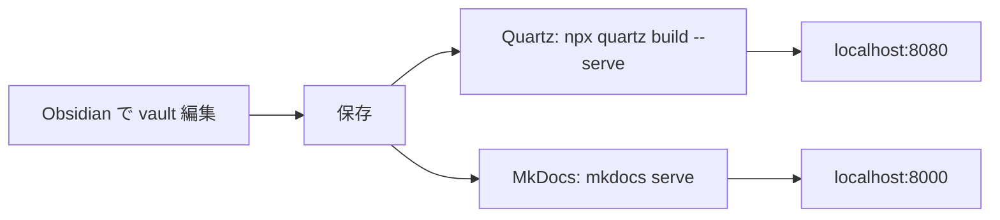

# Obsidian vault レンダリング基盤 設計書

- 作成日: 2026-04-13
- ステータス: Draft（ユーザーレビュー待ち）
- 対象リポジトリ: `github.com/imobile/md`

## 1. 背景と目的

Growi からの移行先として Obsidian vault を GitHub 上で管理する運用を検討している。生の Markdown をそのまま閲覧するのでは視認性・検索性が低いという意見があるため、vault を Web ページとしてレンダリングしたサイトを社内に提供したい。

採用する静的サイトジェネレータ（以下 SSG）として **Quartz v4** と **MkDocs Material** の2候補を比較検証し、実際に同じ vault を両方でレンダリングして採用を決定する。

## 2. ゴール / 非ゴール

### ゴール
- 単一の Obsidian vault をソース・オブ・トゥルースとし、Quartz と MkDocs の双方でレンダリングできるリポジトリ構成を確立する
- Growi 移行で頻出する記法（階層パス / PlantUML / Mermaid / 添付 / wikilink 等）を網羅したサンプル vault を用意し、両 SSG で描画できるか検証する
- 社内 GitHub 組織メンバーにのみ公開される、認証付きの比較サイトを GitHub Pages (Private) に並行デプロイする
- 比較結果を記録し、採用 SSG を決定できる状態にする

### 非ゴール
- Growi の既存コンテンツの自動移行ツール作成（別タスク）
- 採用決定後の本番デプロイ最適化（別タスク）
- Obsidian プラグイン開発
- コメント機能・編集ワークフロー（閲覧のみに焦点）

## 3. 前提

- 閲覧対象: 社内 GitHub 組織メンバーのみ
- GHEC (GitHub Enterprise Cloud) 契約済みで、Private Pages が有効であること（**確認中**）
- Google Workspace SSO が GHEC 側に設定されており、組織メンバーシップ = 認証という状態であること
- 既存の Obsidian vault は存在しない（新規に立ち上げる）
- 開発環境は Windows 11 Pro + PowerShell 7。Developer Mode 有効または `git config --global core.symlinks true` 設定済みを前提とする

## 4. リポジトリ構成

```
md/
├── vault/                       # Obsidian vault。ソース・オブ・トゥルース
│   ├── index.md
│   ├── 00-Guide/                # サイト使い方・記法ガイド
│   ├── 10-Projects/             # プロジェクト文書（Growi 階層移行サンプル）
│   ├── 20-Knowledge/            # ナレッジベース
│   ├── 30-Meetings/YYYY/MM-DD.md
│   ├── 40-People/               # バックリンク多発検証用
│   ├── 90-Sandbox/              # 記法ショーケース
│   ├── _attachments/            # 画像・PDF・zip
│   └── _templates/              # Obsidian テンプレート
│
├── sites/
│   ├── quartz/
│   │   ├── content              # -> ../../vault (symlink)
│   │   ├── quartz.config.ts
│   │   ├── quartz.layout.ts
│   │   └── package.json
│   └── mkdocs/
│       ├── docs                 # -> ../../vault (symlink)
│       ├── mkdocs.yml
│       └── requirements.txt
│
├── scripts/
│   ├── setup-symlinks.ps1       # symlink 初期化
│   └── preview.ps1              # 両サイトをローカル preview
│
├── .github/workflows/
│   ├── pages.yml                # Quartz / MkDocs を並行ビルドして GitHub Pages へ一括デプロイ
│   └── ci.yml                   # PR 時の lint / build 確認
│
├── docs/superpowers/
│   ├── specs/                   # 本設計書置き場
│   └── comparison/              # 比較結果記録
│
├── .gitignore
└── README.md
```

### symlink 運用ルール
- `sites/quartz/content` と `sites/mkdocs/docs` は `vault/` への symlink として作成する
- リポジトリには symlink 情報のみをコミット（実体は vault/ のみ）
- Windows 側のセットアップ手順を README と `scripts/setup-symlinks.ps1` に明記する

## 5. サンプル vault のコンテンツパターン

Growi 移行検証のため、以下を網羅した vault を新規作成する。

### 5-1. 構造・ナビゲーション

| ディレクトリ | 目的 |
|---|---|
| `00-Guide/` | トップページ・このサイトの使い方・記法ガイド |
| `10-Projects/<proj>/<sub>/` | Growi の階層パス（3〜4階層）移行再現 |
| `20-Knowledge/` | タグと wikilink で網状に繋がるノート群 |
| `30-Meetings/YYYY/MM-DD.md` | 日付階層の議事録 |
| `40-People/` | 人物ページ。バックリンク多発で graph view 検証 |
| `90-Sandbox/` | 全記法ショーケース |

### 5-2. 記法ショーケース（各 1 ファイル、`90-Sandbox/` 配下）

| # | パターン | 検証意図 |
|---|---|---|
| 1 | 基本 Markdown（見出し6段・リスト・強調・引用） | SSG ベース挙動 |
| 2 | frontmatter（title / tags / aliases / date / draft） | メタ取扱い |
| 3 | `[[wikilink]]` / `[[page\|alias]]` / `[[page#heading]]` / `[[page^block]]` | リンク解決 |
| 4 | `![[image.png]]` / `![[note]]` / `![[note#h]]` 埋め込み | 埋め込み再現 |
| 5 | 通常画像 `` と添付（PDF, zip） | 添付ハンドリング |
| 6 | callout 12 種（note/info/tip/warning/danger/quote/example/question/success/failure/bug/todo） | callout 互換 |
| 7 | `#tag` / `#tag/nested` / frontmatter tags 混在 | タグページ生成 |
| 8 | Mermaid（flowchart / sequence / class / ER / gantt） | 図の描画 |
| 9 | PlantUML（```plantuml フェンス）★Growi 常用 | 両 SSG での対応可否 |
| 10 | コードブロック（ts / py / bash / diff / 長文 / 言語指定なし） | シンタックスハイライト |
| 11 | 複雑なテーブル（alignment、コロン） | table レンダリング |
| 12 | KaTeX 数式（インライン `$...$` / ブロック `$$...$$`） | 数式対応 |
| 13 | 脚注 `[^1]`、タスクリスト `- [ ]` / `- [x]` | 拡張記法 |
| 14 | 目次を必要とする長文（日本語 5000 字相当） | TOC・パフォーマンス |
| 15 | 絵文字 `:smile:` / Unicode 絵文字 | 絵文字対応 |
| 16 | Growi 移行注意点サンプル（`[/path/to/page]` 形式、Growi 独自 plantuml 表記 等、Before/After 併記） | 移行ガイド兼検証 |
| 17 | バックリンク発生ページ群（相互参照3ページ、`40-People` の人物を複数所から参照） | backlinks / graph |
| 18 | aliases でのリンク到達（`[[旧名]]` → aliases 経由解決） | alias 解決 |
| 19 | 日本語検索用ページ（専門用語・漢字/カナ混在・長文） | 日本語全文検索精度比較 |
| 20 | `draft: true` を含むページ | 未公開制御 |

### 5-3. 添付
- `_attachments/` に画像 2〜3 枚 + PDF 1 件 + zip 1 件を配置（`![[...]]` 埋め込み用）

## 6. Quartz v4 設定方針

| 項目 | 方針 |
|---|---|
| ベース | `npx quartz create` で初期化、`sites/quartz/` 配下 |
| content 参照 | `sites/quartz/content -> ../../vault` (symlink) |
| 無視パターン | `_templates/`、`draft: true`、`.obsidian/` を除外 |
| テーマ | デフォルトテーマから開始。ロゴ・サイトタイトル・フッターのみ調整 |
| Transformer | `FrontMatter` / `ObsidianFlavoredMarkdown` / `Latex`(KaTeX) / `SyntaxHighlighting` / `TableOfContents` / `CrawlLinks` |
| Emitter | `ContentPage` / `FolderPage` / `TagPage` / `ContentIndex`(RSS) / `Assets` / `Static` |
| Mermaid | `ObsidianFlavoredMarkdown` で mermaid 有効化 |
| PlantUML | Quartz 標準非対応のため `remark-plantuml` 相当プラグインを追加。PlantUML サーバ（`www.plantuml.com/plantuml` or 社内サーバ）でレンダリング |
| グラフビュー | 標準 Graph コンポーネント有効 |
| 検索 | 標準 Search（FlexSearch）。日本語トークナイズが弱い場合は bigram カスタム処理を検証項目として追加 |
| 言語 | `configuration.locale: "ja-JP"` |
| baseUrl | `/md/quartz/` |

## 7. MkDocs Material 設定方針

| 項目 | 方針 |
|---|---|
| ベース | `pip install mkdocs-material`、`sites/mkdocs/` 配下 |
| docs 参照 | `sites/mkdocs/docs -> ../../vault` (symlink) |
| テーマ | `material`、palette 自動切替（light/dark）、言語 `ja` |
| ナビ | `awesome-pages` プラグインで自動生成（Obsidian の階層をそのまま反映） |
| プラグイン | `search` / `awesome-pages` / `tags` / `obsidian-support` / `roamlinks` / `callouts` / `ezlinks` / `glightbox` / `git-revision-date-localized` / `backlinks` |
| Markdown 拡張 | `pymdownx.superfences` / `pymdownx.arithmatex`(KaTeX) / `pymdownx.tasklist` / `footnotes` / `toc(permalink)` / `tables` |
| Mermaid | `superfences` の custom_fences に mermaid 登録 |
| PlantUML | `plantuml-markdown` 拡張、PlantUML サーバ URL 設定 |
| 検索 | `search` プラグインで `lang: ['ja', 'en']` |
| 制限事項 | グラフビューなし、バックリンクは `backlinks` プラグインで補完 |
| `draft: true` 除外 | frontmatter 条件で制御 |
| site_url | `https://<org>.github.io/md/mkdocs/` |
| requirements.txt | 上記プラグイン群をバージョンピン留め |

## 8. ビルド・デプロイ・認証

### 8-1. ローカル開発



- `scripts/preview.ps1` で両プレビューを同時起動
- symlink により Obsidian 側の保存が即座に両サイトへ反映

### 8-2. CI / デプロイ

`.github/workflows/pages.yml`:

1. `main` への push をトリガー
2. Quartz を `baseUrl=/md/quartz/` でビルド → `_site/quartz/`
3. MkDocs を `site_url=.../md/mkdocs/` でビルド → `_site/mkdocs/`
4. 比較トップ `_site/index.html` を生成（両サイトへのリンク + 評価観点）
5. `actions/upload-pages-artifact` + `actions/deploy-pages` で `_site/` を一括デプロイ

`.github/workflows/ci.yml`:
- PR 時に両 SSG の build のみ実行（デプロイなし）

### 8-3. 公開 URL

```
https://<org>.github.io/md/          # 比較トップ
https://<org>.github.io/md/quartz/   # Quartz 版
https://<org>.github.io/md/mkdocs/   # MkDocs 版
```

### 8-4. 認証

- GitHub Pages (Private) により **組織メンバーに限定** される
- 組織メンバーシップは Google Workspace SSO で管理されている前提
- 追加の認証レイヤー（Cloudflare Access 等）は不要

## 9. 評価観点

両サイトを並べて以下の観点で評価し、`docs/superpowers/comparison/YYYY-MM-DD-result.md` に記録する。

| # | 観点 | 重み | 確認方法 |
|---|---|---|---|
| 1 | 日本語全文検索の精度 | ★★★ | サンプル `19` で複数キーワード、ヒット率と関連度をスコア化 |
| 2 | wikilink / 埋め込み / alias の再現度 | ★★★ | サンプル `3, 4, 18` の全リンクが正しく解決されるか |
| 3 | callout 再現度 | ★★ | 12 種の callout がスタイル・アイコン付きで描画されるか |
| 4 | PlantUML / Mermaid 描画 | ★★★ | サンプル `8, 9` が両サイトで正しく描画されるか |
| 5 | バックリンク | ★★ | `40-People/` で被リンクが一覧表示されるか |
| 6 | グラフビュー | ★ | あれば加点、必須ではない |
| 7 | タグページ生成と一覧性 | ★★ | `#tag/nested` 階層タグのページ生成 |
| 8 | ナビゲーション（階層） | ★★ | Growi パス階層の読みやすさ |
| 9 | 表示速度・ビルド時間 | ★ | Lighthouse + CI のビルド秒数 |
| 10 | デザイン（視認性・読みやすさ） | ★★ | 主観評価、可能ならレビュー会 |
| 11 | カスタマイズ容易性 | ★ | ロゴ・色変更の工数 |
| 12 | 運用コスト | ★ | CI 時間、依存管理、プラグイン更新頻度 |

## 10. 採用決定後の運用

- 採用 SSG を決定したら、不採用側の `sites/<不採用>/` と関連 workflow を削除
- `_site/` のサブパスは採用後はルートに移すか、そのまま残すかを再検討

## 11. リスク・オープンクエスチョン

| # | 項目 | 対応 |
|---|---|---|
| 1 | GHEC で Private Pages が未有効な場合 | 組織 Admin に有効化依頼。未解決なら Cloudflare Pages + Access にフォールバック |
| 2 | Quartz v4 の日本語検索精度が実用レベルでない場合 | bigram カスタム処理 or 検索エンジン差し替えを比較結果に反映（採用判断の一要素） |
| 3 | PlantUML サーバの選定（公開サーバ利用 vs 社内サーバ構築） | 比較フェーズは公開サーバで OK、機密性要件次第で社内サーバ化 |
| 4 | Windows の Developer Mode / `core.symlinks` 設定が一部端末で未適用 | README に手順、`scripts/setup-symlinks.ps1` に検出ロジック |
| 5 | Growi 独自記法（`[/path]` 形式リンク等）の自動変換 | 本 spec ではスコープ外。移行ツールは別タスクで検討 |
| 6 | PlantUML / Mermaid 大量ページでビルドが遅い | 実測後に必要なら cache 設定、または並列化 |

## 12. スコープ外

- Growi からの既存コンテンツ自動移行
- 採用決定後の本番運用最適化
- Obsidian プラグイン開発
- 編集ワークフロー・コメント機能
- vault の backup / 冗長化戦略
