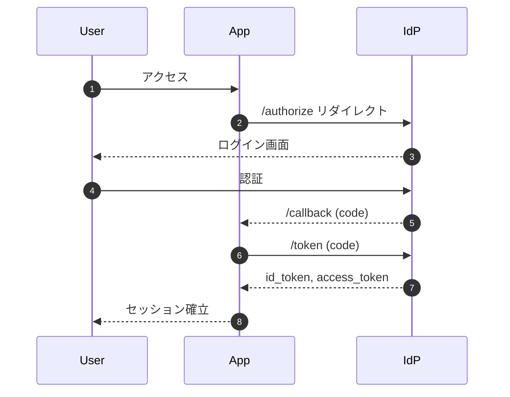

# 認証設計

Project Alpha の認証方式に関する設計ドキュメント。

## 方針

OAuth 2.0 / OIDC を採用し、社内 IdP（Google Workspace）に委譲する。

## シーケンス

```mermaid
sequenceDiagram
    autonumber
    User->>App: アクセス
    App->>IdP: /authorize リダイレクト
    IdP-->>User: ログイン画面
    User->>IdP: 認証
    IdP-->>App: /callback (code)
    App->>IdP: /token (code)
    IdP-->>App: id_token, access_token
    App-->>User: セッション確立
```

関連: [[data-model|データモデル]]、[[../overview|プロジェクト概要]]
