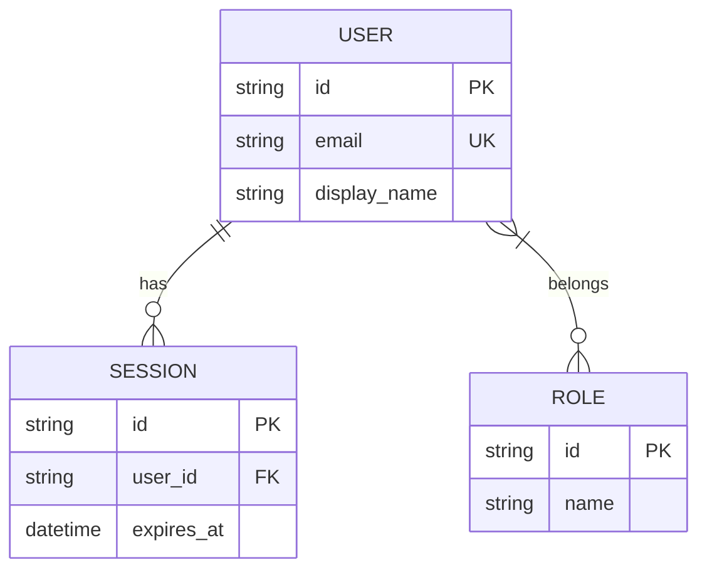

# データモデル

## エンティティ

- `User`: 社員
- `Session`: ログインセッション
- `Role`: 権限ロール

## ER 図

```mermaid
erDiagram
    USER ||--o{ SESSION : has
    USER }|--o{ ROLE : belongs
    USER {
        string id PK
        string email UK
        string display_name
    }
    SESSION {
        string id PK
        string user_id FK
        datetime expires_at
    }
    ROLE {
        string id PK
        string name
    }
```

関連: [[auth|認証設計]]
