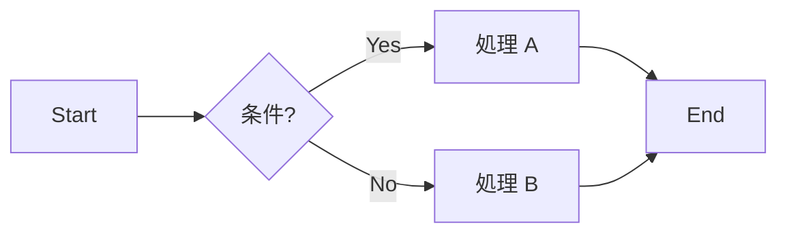
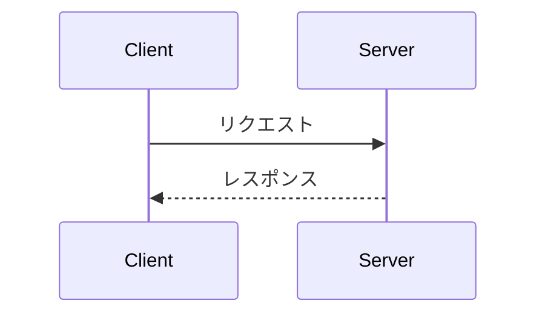
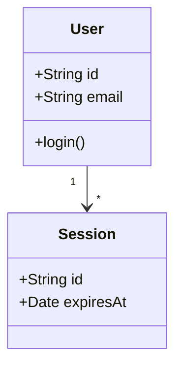
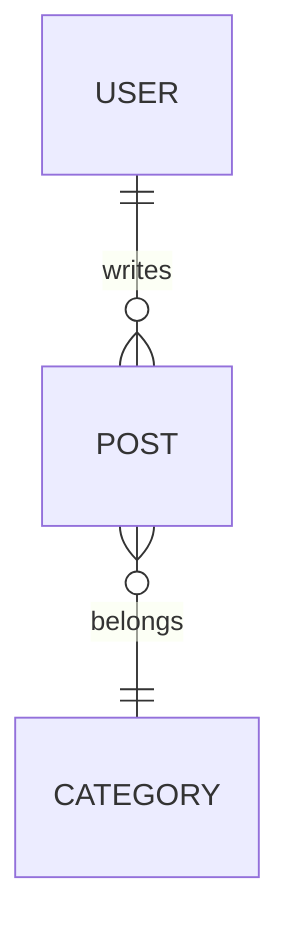
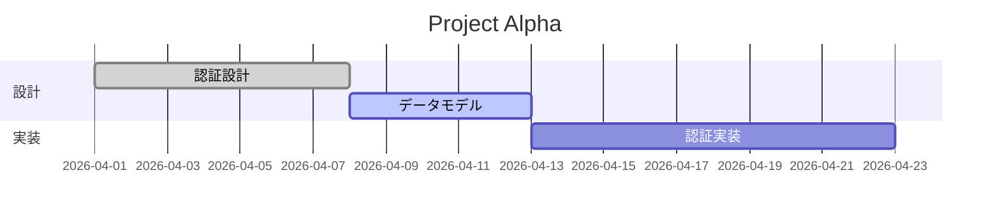

# 08 Mermaid

## Flowchart

```mermaid
flowchart LR
    Start --> Check{条件?}
    Check -- Yes --> DoA[処理 A]
    Check -- No --> DoB[処理 B]
    DoA --> End
    DoB --> End
```

## Sequence

```mermaid
sequenceDiagram
    Client->>Server: リクエスト
    Server-->>Client: レスポンス
```

## Class

```mermaid
classDiagram
    class User {
        +String id
        +String email
        +login()
    }
    class Session {
        +String id
        +Date expiresAt
    }
    User "1" --> "*" Session
```

## ER

```mermaid
erDiagram
    USER ||--o{ POST : writes
    POST }o--|| CATEGORY : belongs
```

## Gantt

```mermaid
gantt
    title Project Alpha
    dateFormat YYYY-MM-DD
    section 設計
    認証設計 :done, a1, 2026-04-01, 7d
    データモデル :active, a2, 2026-04-08, 5d
    section 実装
    認証実装 :a3, after a2, 10d
```

## 検証ポイント

- 5 種類すべて描画されるか
- ダークモード時に読めるか
