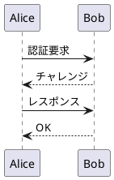
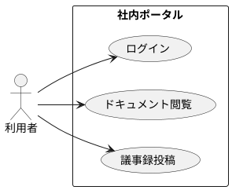
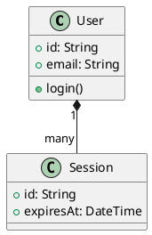

# 09 PlantUML

Growi で常用されている PlantUML が両 SSG で描画できるか検証する。

## Sequence

## Use Case

## Class

## 検証ポイント

- Quartz: `remark-plantuml` 系プラグインでサーバレンダリングされるか
- MkDocs: `plantuml-markdown` 拡張でレンダリングされるか
- PlantUML サーバ: `www.plantuml.com/plantuml`（比較フェーズのみ。本番は社内サーバ検討）
