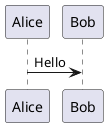

# 16 Growi 移行注意点

Growi 特有の記法 → Obsidian 形式への書き換え指針。

## パスリンク

**Before (Growi):**

```
[/project/alpha/design/auth]
```

**After (Obsidian):**

```
[[10-Projects/alpha/design/auth|認証設計]]
```

## PlantUML

**Before (Growi)** — 独自の拡張ブロックを使っているケース:

```
@startuml
Alice -> Bob: Hello
@enduml
```

（本文中に直接書かれていた場合）

**After (Obsidian):**



必ず ` ```plantuml ` フェンスで囲む。

## 画像パス

**Before (Growi):**

```

```

**After (Obsidian):**

```
![[sample-diagram.png]]
```

添付ファイルを `vault/_attachments/` に配置し、Obsidian 形式で参照。

## コメント / いいね / 履歴

- コメント機能: 静的サイトでは非対応。PR/Issue に寄せる運用に変更
- いいね: 非対応（Slack リアクション等で代替）
- 履歴: Git 履歴に移行（`git log <file>`）

## 検証ポイント

- Before/After の両方が記事内で正しく描画されるか（After のみ描画、Before は Code として残す）
